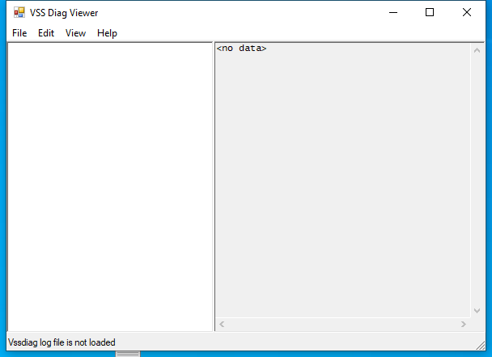

---
title: vsdiagview.exe | 
excerpt: What is vsdiagview.exe?
---

# vsdiagview.exe 

* File Path: `C:\Program Files (x86)\Windows Kits\10\bin\10.0.19041.0\x64\vsdiagview.exe`
* Description: File Format Error (Window Title)

## Screenshot

## Hashes

Type | Hash
-- | --
MD5 | `6ECF9487B5302CBC1C33A04D4D994AC5`
SHA1 | `19CFC015BE484A9CC652BCC11CF3E13C5DA167D6`
SHA256 | `03DA07A128235ECAEE0D8DB18139AA28973CA7C2B4463F8A79CA90E8E2B4C8BF`
SHA384 | `793F4A2D379686D125C027FC99EED6D831285575890DA9620FC5CB8A3EBB85C12BC2063262EE56180E6EB38178FD83BC`
SHA512 | `FB3DFB736E8DD7C7DC0564328D6B62EAD1823E4DF0B3ADDFB565B36401909F519E8385635D86770B392A210D34405895ED99EEC1EA91F582582A56DC6EE0EA8D`
SSDEEP | `768:pqXzBgHsUieX8a2GnT2GefO2GUlFfDlEycO929:QBgHBPifQK`
IMP | `F34D5F2D4577ED6D9CEEC516C1F5A744`
PESHA1 | `579C31926E4EEA5972B2E75E78854FA2740FD133`
PE256 | `A498E07FF711936357DA875E088852932CD597B37BF9C9E6E24B9F3481AF19CD`

## Runtime Data

### Window Title:
File Format Error

### Open Handles:

Path | Type
-- | --
(R--)   C:\Users\user\--help | File
(R-D)   C:\Windows\Fonts\StaticCache.dat | File
(R-D)   C:\Windows\Microsoft.NET\assembly\GAC_64\mscorlib\v4.0_4.0.0.0__b77a5c561934e089\mscorlib.dll | File
(R-D)   C:\Windows\Microsoft.NET\assembly\GAC_MSIL\Accessibility\v4.0_4.0.0.0__b03f5f7f11d50a3a\Accessibility.dll | File
(R-D)   C:\Windows\Microsoft.NET\assembly\GAC_MSIL\System.Configuration\v4.0_4.0.0.0__b03f5f7f11d50a3a\System.Configuration.dll | File
(R-D)   C:\Windows\Microsoft.NET\assembly\GAC_MSIL\System.Drawing\v4.0_4.0.0.0__b03f5f7f11d50a3a\System.Drawing.dll | File
(R-D)   C:\Windows\Microsoft.NET\assembly\GAC_MSIL\System.Windows.Forms\v4.0_4.0.0.0__b77a5c561934e089\System.Windows.Forms.dll | File
(R-D)   C:\Windows\Microsoft.NET\assembly\GAC_MSIL\System.Xml\v4.0_4.0.0.0__b77a5c561934e089\System.XML.dll | File
(R-D)   C:\Windows\Microsoft.NET\assembly\GAC_MSIL\System\v4.0_4.0.0.0__b77a5c561934e089\System.dll | File
(R-D)   C:\Windows\System32\en-US\user32.dll.mui | File
(RW-)   C:\Users\user | File
(RW-)   C:\Windows\WinSxS\amd64_microsoft.windows.common-controls_6595b64144ccf1df_5.82.19041.488_none_4238de57f6b64d28 | File
(RW-)   C:\Windows\WinSxS\amd64_microsoft.windows.common-controls_6595b64144ccf1df_6.0.19041.488_none_ca04af081b815d21 | File
(RW-)   C:\Windows\WinSxS\amd64_microsoft.windows.gdiplus_6595b64144ccf1df_1.1.19041.685_none_faeca4db76168538 | File
\...\Cor_SxSPublic_IPCBlock | Section
\BaseNamedObjects\C:\*ProgramData\*Microsoft\*Windows\*Caches\*{6AF0698E-D558-4F6E-9B3C-3716689AF493}.2.ver0x0000000000000002.db | Section
\BaseNamedObjects\C:\*ProgramData\*Microsoft\*Windows\*Caches\*{DDF571F2-BE98-426D-8288-1A9A39C3FDA2}.2.ver0x0000000000000002.db | Section
\BaseNamedObjects\C:\*ProgramData\*Microsoft\*Windows\*Caches\*cversions.2 | Section
\BaseNamedObjects\Cor_Private_IPCBlock_v4_7660 | Section
\BaseNamedObjects\NLS_CodePage_1252_3_2_0_0 | Section
\BaseNamedObjects\NLS_CodePage_437_3_2_0_0 | Section
\Sessions\1\BaseNamedObjects\windows_shell_global_counters | Section
\Sessions\1\Windows\Theme1383959086 | Section
\Windows\Theme2042523233 | Section

### Loaded Modules:

Path |
-- |
C:\Program Files (x86)\Windows Kits\10\bin\10.0.19041.0\x64\vsdiagview.exe |
C:\Windows\System32\ADVAPI32.dll |
C:\Windows\System32\KERNEL32.dll |
C:\Windows\System32\KERNELBASE.dll |
C:\Windows\SYSTEM32\MSCOREE.DLL |
C:\Windows\System32\msvcrt.dll |
C:\Windows\SYSTEM32\ntdll.dll |
C:\Windows\System32\RPCRT4.dll |
C:\Windows\System32\sechost.dll |

## Signature

* Status: Signature verified.
* Serial: `33000002CF6D2CC57CAA65A6D80000000002CF`
* Thumbprint: `1A221B3B4FEF088B17BA6704FD088DF192D9E0EF`
* Issuer: CN=Microsoft Code Signing PCA 2010, O=Microsoft Corporation, L=Redmond, S=Washington, C=US
* Subject: CN=Microsoft Corporation, O=Microsoft Corporation, L=Redmond, S=Washington, C=US

## File Metadata

* Original Filename: vsdiagview.exe
* Product Name: Microsoft (R) Windows (R) Operating System
* Company Name: Microsoft Corporation
* File Version: 10.0.19041.1
* Product Version: 10.0.19041.1
* Language: Language Neutral
* Legal Copyright: Copyright (c) Microsoft Corporation. All rights reserved.
* Machine Type: 32-bit

## File Scan

* VirusTotal Detections: Unknown

## File Similarity (ssdeep match)

File | Score
-- | --
[C:\Program Files (x86)\Windows Kits\10\bin\10.0.19041.0\arm64\vsdiagview.exe](vsdiagview.exe-5922F42724F44A94E36C749125321674.md) | 83
[C:\Program Files (x86)\Windows Kits\10\bin\10.0.19041.0\x86\vsdiagview.exe](vsdiagview.exe-97FCA419DE9869C6616AD37B6A6CA283.md) | 80

MIT License. Copyright (c) 2020-2021 Strontic.

