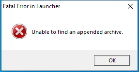

---
title: w32.exe | 
excerpt: What is w32.exe?
---

# w32.exe 

* File Path: `C:\program files\GIMP 2\lib\python2.7\site-packages\distlib\w32.exe`
* Description: Fatal Error in Launcher (Window Title)

## Screenshot

## Hashes

Type | Hash
-- | --
MD5 | `BA0A8E1736312C7DA2B734D0F7242442`
SHA1 | `7DF56B7B63DD9A3D04F3AD9F444C9DFE00E53942`
SHA256 | `576F2E6E8BB8DFD4A1472B3A8587EA22180A9593CCD6A42978124AEA328CF813`
SHA384 | `D90A415ADED54349647618D826D538F8CC0DBFD30C95B201C554CC6AC0AF3D93C8BCC5706BE9E60404843D912BF58931`
SHA512 | `B711084F94E80F98865D1C3BF7D4C4071213B8848E5C9D090DA51931D0E428FBBFD5F4BA3C22048CDB4B53E0F16353F1EE53330A715EC96935981F7892BFA75F`
SSDEEP | `1536:SFEL0c3++wG5NlKOln9N7oKsMmuB2IMokC+0FfHYToqM:SFUxlnjmDXokC+GfHYToqM`

## Runtime Data

### Window Title:
Fatal Error in Launcher

### Open Handles:

Path | Type
-- | --
(R--)   C:\Program Files\GIMP 2\lib\python2.7\site-packages\distlib\w32.exe | File
(R-D)   C:\Windows\Fonts\StaticCache.dat | File
(RW-)   C:\Users\user\Documents | File
(RW-)   C:\Windows | File
\BaseNamedObjects\NLS_CodePage_1252_3_2_0_0 | Section
\BaseNamedObjects\NLS_CodePage_437_3_2_0_0 | Section
\Sessions\1\Windows\Theme4048709601 | Section
\Windows\Theme603176458 | Section

### Loaded Modules:

Path |
-- |
C:\program files\GIMP 2\lib\python2.7\site-packages\distlib\w32.exe |
C:\Windows\SYSTEM32\ntdll.dll |
C:\Windows\System32\wow64.dll |
C:\Windows\System32\wow64cpu.dll |
C:\Windows\System32\wow64win.dll |

## Signature

* Status: The file C:\program files\GIMP 2\lib\python2.7\site-packages\distlib\w32.exe is not digitally signed. You cannot run this script on the current system. For more information about running scripts and setting execution policy, see about_Execution_Policies at https:/go.microsoft.com/fwlink/?LinkID=135170
* Serial: ``
* Thumbprint: ``
* Issuer: 
* Subject: 

## File Metadata

* Original Filename: 
* Product Name: 
* Company Name: 
* File Version: 
* Product Version: 
* Language: 
* Legal Copyright: 

## File Similarity (ssdeep match)

File | Score
-- | --
[C:\program files (x86)\Python38-32\Lib\site-packages\pip\_vendor\distlib\w32.exe](w32.exe-4A895EC6C5A9DF94820219EF525CF65A.md) | 97
[C:\program files (x86)\Python38-32\Scripts\pip.exe](pip.exe-4A17B3EEC62A2F1DB47D2C6927A7F506.md) | 38
[C:\program files (x86)\Python38-32\Scripts\pip3.8.exe](pip3.8.exe-4A17B3EEC62A2F1DB47D2C6927A7F506.md) | 38
[C:\program files (x86)\Python38-32\Scripts\pip3.exe](pip3.exe-4A17B3EEC62A2F1DB47D2C6927A7F506.md) | 38
[C:\program files\GIMP 2\lib\python2.7\site-packages\pip\_vendor\distlib\w32.exe](w32.exe-D4467C3976D9C336693B816E28BD596F.md) | 99
[C:\Program Files\Python38\Lib\site-packages\pip\_vendor\distlib\w32.exe](w32.exe-4A895EC6C5A9DF94820219EF525CF65A.md) | 97

MIT License. Copyright (c) 2020-2021 Strontic.

