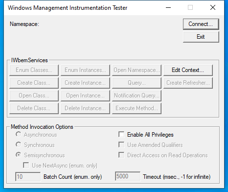
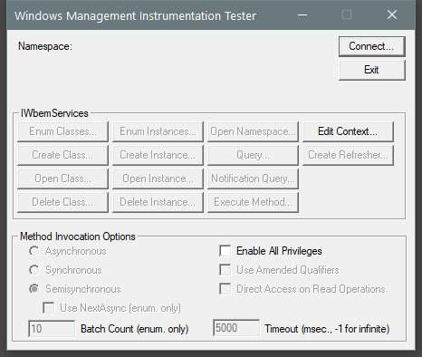

---
title: wbemtest.exe | WMI Test Tool
excerpt: What is wbemtest.exe?
---

# wbemtest.exe 

* File Path: `C:\Windows\system32\wbem\wbemtest.exe`
* Description: WMI Test Tool

## Screenshot

## Hashes

Type | Hash
-- | --
MD5 | `7191ED192D1E26E50B671C2AAD99D451`
SHA1 | `09F44936A472D838AC78BD4B87AB6454C05E3152`
SHA256 | `3406B6ADF7D5BF8D7B75C9761B9BA24D1DABA8EE00BC5D014FE947B2DC0423A4`
SHA384 | `5CC6E2B7919594CFDCF946F43BEBE9FA959E37E7879F748226F755D3BF6B63EE1F21F8AF3FAE52D9A4A05FE5A0FBDAB9`
SHA512 | `BD92E3C4181F2ADDF4F8C37454B9AC516EABA9288DE48F1AD3BE3EAD8766B6B6A62912251CC507E9ED5F0751896E1A0EC5EC558E5ADC726A80EED3CF6FC9C6FF`
SSDEEP | `3072:g/UskdhY3KILrzFHS1r5GMezOhflHwEwgIcENsz8JirIz4TqGf5KhIPFJRAhP2Ey:g/UskdhYLLHFHSx5GMXdQU5bDeP`
IMP | `CDFDFC84E739873776D87479B9819CD0`
PESHA1 | `4F43608B2D9A3DCED123ACB0770EBC95685F759F`
PE256 | `E4812DA33D352BB17EEA11DE8402DF98C086307098CAFC45623B8F0DEB9777E2`

## Runtime Data

### Window Title:
Windows Management Instrumentation Tester

### Open Handles:

Path | Type
-- | --
(R-D)   C:\Windows\Fonts\StaticCache.dat | File
(R-D)   C:\Windows\System32\en-US\user32.dll.mui | File
(R-D)   C:\Windows\System32\wbem\en-US\wbemtest.exe.mui | File
(RW-)   C:\Users\user | File
(RW-)   C:\Windows\WinSxS\amd64_microsoft.windows.common-controls_6595b64144ccf1df_6.0.17763.1518_none_de6e2bd0534e2567 | File
\BaseNamedObjects\C:\*ProgramData\*Microsoft\*Windows\*Caches\*{6AF0698E-D558-4F6E-9B3C-3716689AF493}.2.ver0x0000000000000004.db | Section
\BaseNamedObjects\C:\*ProgramData\*Microsoft\*Windows\*Caches\*{DDF571F2-BE98-426D-8288-1A9A39C3FDA2}.2.ver0x0000000000000004.db | Section
\BaseNamedObjects\C:\*ProgramData\*Microsoft\*Windows\*Caches\*cversions.2.ro | Section
\BaseNamedObjects\NLS_CodePage_1252_3_2_0_0 | Section
\BaseNamedObjects\NLS_CodePage_437_3_2_0_0 | Section
\Sessions\2\Windows\Theme2131664586 | Section
\Windows\Theme966197582 | Section

### Loaded Modules:

Path |
-- |
C:\Windows\System32\advapi32.dll |
C:\Windows\System32\bcrypt.dll |
C:\Windows\System32\bcryptPrimitives.dll |
C:\Windows\System32\combase.dll |
C:\Windows\System32\GDI32.dll |
C:\Windows\System32\gdi32full.dll |
C:\Windows\System32\KERNEL32.DLL |
C:\Windows\System32\KERNELBASE.dll |
C:\Windows\System32\msvcp_win.dll |
C:\Windows\System32\msvcrt.dll |
C:\Windows\SYSTEM32\ntdll.dll |
C:\Windows\System32\ole32.dll |
C:\Windows\System32\OLEAUT32.dll |
C:\Windows\System32\RPCRT4.dll |
C:\Windows\System32\sechost.dll |
C:\Windows\System32\ucrtbase.dll |
C:\Windows\System32\USER32.dll |
C:\Windows\system32\wbem\wbemtest.exe |
C:\Windows\SYSTEM32\wbemcomn.dll |
C:\Windows\System32\win32u.dll |
C:\Windows\System32\WS2_32.dll |

## Signature

* Status: Signature verified.
* Serial: `33000001C422B2F79B793DACB20000000001C4`
* Thumbprint: `AE9C1AE54763822EEC42474983D8B635116C8452`
* Issuer: CN=Microsoft Windows Production PCA 2011, O=Microsoft Corporation, L=Redmond, S=Washington, C=US
* Subject: CN=Microsoft Windows, O=Microsoft Corporation, L=Redmond, S=Washington, C=US

## File Metadata

* Original Filename: wbemtest.exe.mui
* Product Name: Microsoft Windows Operating System
* Company Name: Microsoft Corporation
* File Version: 10.0.17763.1 (WinBuild.160101.0800)
* Product Version: 10.0.17763.1
* Language: English (United States)
* Legal Copyright:  Microsoft Corporation. All rights reserved.
* Machine Type: 64-bit

## File Scan

* VirusTotal Detections: 0/70
* VirusTotal Link: https://www.virustotal.com/gui/file/3406b6adf7d5bf8d7b75c9761b9ba24d1daba8ee00bc5d014fe947b2dc0423a4/detection/

## File Similarity (ssdeep match)

File | Score
-- | --
[C:\Windows\system32\wbem\wbemtest.exe](wbemtest.exe-0BE7ED026AA1220DE3C2F099983E35CA.md) | 32
[C:\Windows\system32\wbem\wbemtest.exe](wbemtest.exe-1EBB06162C3C56B97B98D144B00FFD28.md) | 33
[C:\windows\system32\wbem\wbemtest.exe](wbemtest.exe-5296801CCC59CE9ACCCD6B71C336FF6D.md) | 32
[C:\WINDOWS\system32\wbem\wbemtest.exe](wbemtest.exe-6C18ACC7CDEFAECAA87E3956BE3E5117.md) | 41
[C:\windows\system32\wbem\WinMgmt.exe](WinMgmt.exe-092579DC0605F9E0AFC60F24E7B7FAAE.md) | 30
[C:\Windows\system32\wbem\WinMgmt.exe](WinMgmt.exe-2F273D2B73B94F799A2D822F25373013.md) | 35
[C:\Windows\system32\wbem\WinMgmt.exe](WinMgmt.exe-7EEBC2D73DB966BC35A8031FA60FC161.md) | 30
[C:\WINDOWS\system32\wbem\WinMgmt.exe](WinMgmt.exe-A6C0A35BFA37660599DF474940FFD646.md) | 30
[C:\Windows\system32\wbem\WinMgmt.exe](WinMgmt.exe-B4B55EE866E956C91700EAB60B878D7F.md) | 35
[C:\Windows\system32\wbem\WinMgmt.exe](WinMgmt.exe-D96E50EFADC0675C470151AC6261F47C.md) | 33
[C:\Windows\SysWOW64\wbem\wbemcntl.dll](wbemcntl.dll-71797B2BDC1615C0546726E2D9120A75.md) | 25
[C:\Windows\SysWOW64\wbem\WinMgmt.exe](WinMgmt.exe-3CCDE22442B58A5642B694F8157D0040.md) | 35
[C:\Windows\SysWOW64\wbem\WinMgmt.exe](WinMgmt.exe-AE6F6C96E29E44B34CA7986E20D7562B.md) | 35
[C:\WINDOWS\SysWOW64\wbem\WinMgmt.exe](WinMgmt.exe-B8FAB36A19DB84D93BB1DD037CEF60B7.md) | 33
[C:\windows\SysWOW64\wbem\WinMgmt.exe](WinMgmt.exe-C6252D21A543F04AF3E7DAF358BE68A4.md) | 33
[C:\Windows\SysWOW64\wbem\WinMgmt.exe](WinMgmt.exe-C68950E7D9C927A3E85BD95112DE45BC.md) | 33

MIT License. Copyright (c) 2020 Strontic.

