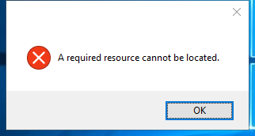

---
title: wextract.exe | Win32 Cabinet Self-Extractor                                           
---

# wextract.exe 

* File Path: `C:\windows\SysWOW64\wextract.exe`
* Description: Win32 Cabinet Self-Extractor                                           

## Screenshot

## Hashes

Type | Hash
-- | --
MD5 | `7CD5F431EA58317F3B2E582F2D1DDFE9`
SHA1 | `69F8EDC59857CE46821CED8342DA1C875CA05DA6`
SHA256 | `64BC17D02D409B0EAE84DCCC71DD0C5115EF208EFC79A30281E60404A5632D91`
SHA384 | `54882F879ED5203840DBFC08B85216DF2F793FBEB98615351DE84ABF9F3832B24723BA90F160B2C3E4EB32AD53DA6CE0`
SHA512 | `E537056E3EA60BB918C0C8538445BE775B0B16775B2EC5FA92B9C2EAA394B3C425D47D5C0C7B9262A28BC42B5D76D03622758A058913AAC628841BBAE4B11566`
SSDEEP | `3072:KZy+bnr+O1m8Wp1icKAArDZz4N9GhbkUNEk951d:KZy+bnr+f9p0yN90vE`

## Signature

* Status: Signature verified.
* Serial: `33000001C422B2F79B793DACB20000000001C4`
* Thumbprint: `AE9C1AE54763822EEC42474983D8B635116C8452`
* Issuer: CN=Microsoft Windows Production PCA 2011, O=Microsoft Corporation, L=Redmond, S=Washington, C=US
* Subject: CN=Microsoft Windows, O=Microsoft Corporation, L=Redmond, S=Washington, C=US

## File Metadata

* Original Filename: WEXTRACT.EXE            .MUI
* Product Name: Internet Explorer
* Company Name: Microsoft Corporation
* File Version: 11.00.17763.1 (WinBuild.160101.0800)
* Product Version: 11.00.17763.1
* Language: English (United States)
* Legal Copyright:  Microsoft Corporation. All rights reserved.

## File Similarity (ssdeep match)

File | Score
-- | --
[C:\windows\system32\wextract.exe](wextract.exe-4B9C652BD0FD95A9E6123913C35519D6.md) | 71
[C:\Windows\system32\wextract.exe](wextract.exe-56E501E3E49CFDE55EB1CAABE6913E45.md) | 77
[C:\Windows\system32\wextract.exe](wextract.exe-91243AFCF25E3A7705CAAA03492996B7.md) | 75
[C:\WINDOWS\system32\wextract.exe](wextract.exe-A740582789B3622EAAA53D2D31955363.md) | 71
[C:\Windows\system32\wextract.exe](wextract.exe-EF82872F2141313EF07C49405145DF3B.md) | 69
[C:\Windows\system32\wusa.exe](wusa.exe-59701FE9C8BA85BCEB73A9B1B3E8E1C4.md) | 40
[C:\WINDOWS\SysWOW64\wextract.exe](wextract.exe-3035914DF08E473A10745C662047A63D.md) | 75
[C:\Windows\SysWOW64\wextract.exe](wextract.exe-330C79E31445B8A75F18EB503BC07029.md) | 74
[C:\windows\SysWOW64\wextract.exe](wextract.exe-A66A88FFE53BBB9DDAACE0110A8232EC.md) | 71
[C:\Windows\SysWOW64\wextract.exe](wextract.exe-B9CC7E24DB7DE2E75678761B1D8BAC3E.md) | 72
[C:\Windows\SysWOW64\wusa.exe](wusa.exe-18DE1F2C1BC5B1AFE3A66DD973C69411.md) | 38

MIT License. Copyright (c) 2020 Strontic.

