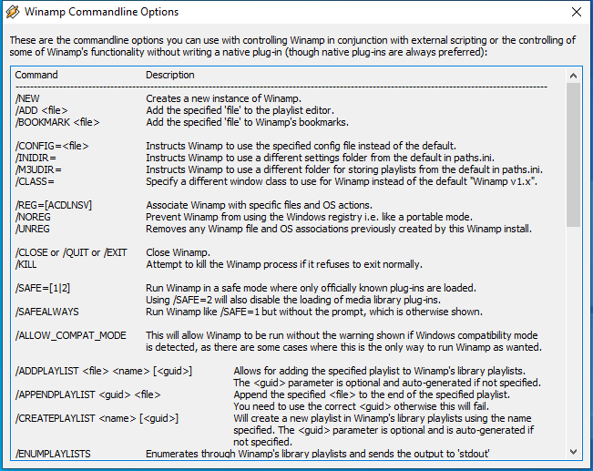
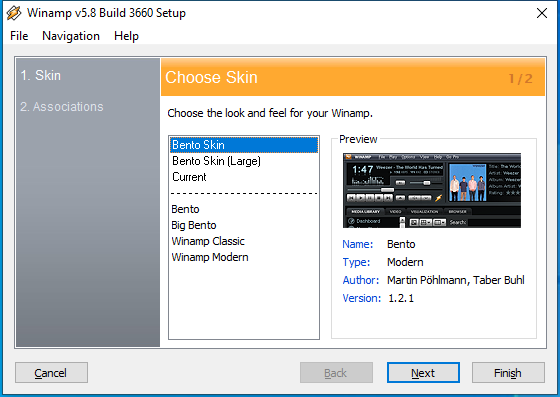

---
title: winamp.exe | 
excerpt: What is winamp.exe?
---

# winamp.exe 

* File Path: `C:\Program Files (x86)\MediaMonkey\winamp.exe`

## Screenshot

## Hashes

Type | Hash
-- | --
MD5 | `D87E6EA099C77800113BAA4EE7BD9FA6`
SHA1 | `27BE642A41E81465E624C2810A47234840FDA330`
SHA256 | `80394EB4707C5651979C4C05F33BC3DC247094068D4ACF008C99DE82C60B4668`
SHA384 | `9144894A79A5ACA4A368BFD84E1365C2EDE91F62AD4356EECD8B045EA187BC74AF8FF39A2C880FD7517D2A5B58DCC359`
SHA512 | `841F0A7AAFA01E0C716E1BE5E0869EBF8F5844D57F52BF3495404B76B36D5DC5FA14A1F30993BEE959558371705073C6D0E92A2334AE119F4E7C70B6079CC602`
SSDEEP | `384:yfwhiuDIPi/ij7m+1IKbqZTYmJp27REzJXdJPg6Bha/zVQvnfePPLxlX:yIZDSi/ija+1IbZvm6tJHoEmdl`
IMP | `169DBC57E37B49E3B77523854C5A6CB3`
PESHA1 | `5743CDEB31402E957ECCE9F71A42631B22766B0B`
PE256 | `4344A2825EEEC21ED1761081D086BD105A852508AAE042AE9DCB965AF34677C8`

## Runtime Data

### Loaded Modules:

Path |
-- |
C:\Program Files (x86)\MediaMonkey\winamp.exe |
C:\Windows\SYSTEM32\ntdll.dll |
C:\Windows\System32\wow64.dll |
C:\Windows\System32\wow64cpu.dll |
C:\Windows\System32\wow64win.dll |

## Signature

* Status: Signature verified.
* Serial: `7B48448F76331B9D5BCA1077F55FD710`
* Thumbprint: `8369C04328BF47436E5A459D1473F8DB66552DE2`
* Issuer: CN=thawte SHA256 Code Signing CA, O="thawte, Inc.", C=US
* Subject: CN="Ventis Media, Inc.", OU=Application Development, O="Ventis Media, Inc.", L=Cote Saint-Luc, S=Quebec, C=CA

## File Metadata

* Original Filename: 
* Product Name: 
* Company Name: 
* File Version: 
* Product Version: 
* Language: 
* Legal Copyright: 
* Machine Type: 32-bit

## File Scan

* VirusTotal Detections: 0/72
* VirusTotal Link: https://www.virustotal.com/gui/file/80394eb4707c5651979c4c05f33bc3dc247094068d4acf008c99de82c60b4668/detection/

MIT License. Copyright (c) 2020 Strontic.

