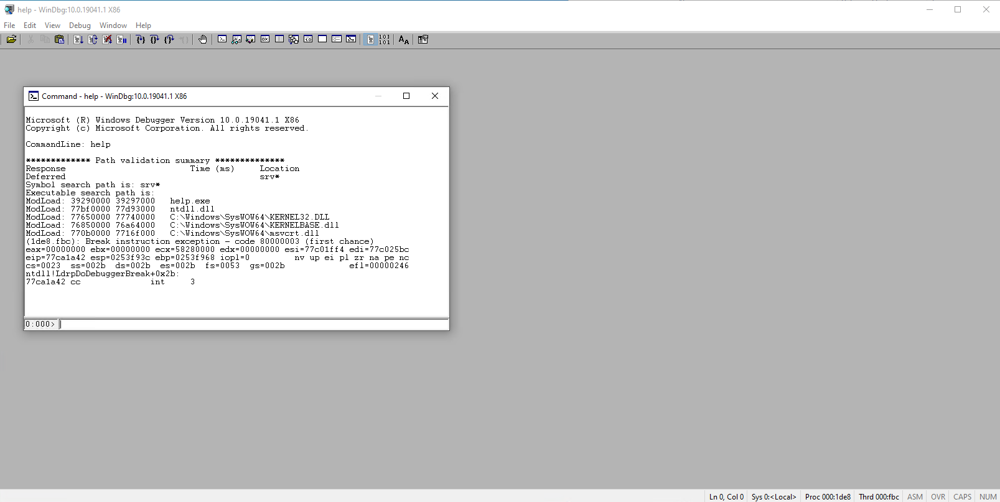

---
title: windbg.exe | Windows GUI symbolic debugger
excerpt: What is windbg.exe?
---

# windbg.exe 

* File Path: `C:\Program Files (x86)\Windows Kits\10\Debuggers\x64\windbg.exe`
* Description: Windows GUI symbolic debugger

## Screenshot

## Hashes

Type | Hash
-- | --
MD5 | `8CC7AB7DC9C670809113929568FB3F31`
SHA1 | `A5B6A107B4D5318D6B666E3CC831E967E999C039`
SHA256 | `179730146A9A47DF359128F3A49BF09DE932F6F9EECF5BDC96918C5647598BC5`
SHA384 | `4FDEFF919DD1B1B1F3CFB7618D40F8842611D4AF0101C3EBF4579C1126AA3D72465BDE020DD6A601D061AC79E131C250`
SHA512 | `6B0D0715BBC2703076E07A55EDF378D3B9AB8FC2737947D1A7D23C1621F9D6CC323FD909C6A8366DB60166D4B28079ECBFBD9929BA974CD19429B76BCEBFC217`
SSDEEP | `12288:fZcJofqA3te2VZds33/VgI1y4erFR/32Ousrte4:BcGfqA3te2Si+y4enmOuge`
IMP | `0D94733CE3020EDCCF4DFF51CEA82E82`
PESHA1 | `FF4A5553212033E6FC3DC28B04413CFE9520B3D0`
PE256 | `9B6D625987984B9386D112A93AF03E1AEB03981E6DC471FD55F78D9BDEB17131`

## Runtime Data

### Child Processes:
help.exe

### Window Title:
help - WinDbg:10.0.19041.1 AMD64 

### Open Handles:

Path | Type
-- | --
(R-D)   C:\Program Files (x86)\Windows Kits\10\Debuggers\x64\sym\ntdll.pdb\1EB9FACB04C73C5DEA7160764CD333D01\ntdll.pdb | File
(R-D)   C:\Windows\Fonts\StaticCache.dat | File
(RW-)   C:\Users\user | File
(RW-)   C:\Windows\WinSxS\amd64_microsoft.windows.common-controls_6595b64144ccf1df_6.0.19041.488_none_ca04af081b815d21 | File
(RWD)   C:\Windows\System32\ntdll.dll | File
\BaseNamedObjects\__ComCatalogCache__ | Section
\BaseNamedObjects\C:\*ProgramData\*Microsoft\*Windows\*Caches\*{6AF0698E-D558-4F6E-9B3C-3716689AF493}.2.ver0x0000000000000002.db | Section
\BaseNamedObjects\C:\*ProgramData\*Microsoft\*Windows\*Caches\*{DDF571F2-BE98-426D-8288-1A9A39C3FDA2}.2.ver0x0000000000000002.db | Section
\BaseNamedObjects\C:\*ProgramData\*Microsoft\*Windows\*Caches\*cversions.2 | Section
\BaseNamedObjects\NLS_CodePage_1252_3_2_0_0 | Section
\BaseNamedObjects\NLS_CodePage_437_3_2_0_0 | Section
\Sessions\1\BaseNamedObjects\1dbcHWNDInterface:5802de | Section
\Sessions\1\Windows\Theme1383959086 | Section
\Windows\Theme2042523233 | Section

### Loaded Modules:

Path |
-- |
C:\Program Files (x86)\Windows Kits\10\Debuggers\x64\dbghelp.dll |
C:\Program Files (x86)\Windows Kits\10\Debuggers\x64\windbg.exe |
C:\Windows\System32\ADVAPI32.dll |
C:\Windows\System32\combase.dll |
C:\Windows\System32\GDI32.dll |
C:\Windows\System32\gdi32full.dll |
C:\Windows\System32\KERNEL32.DLL |
C:\Windows\System32\KERNELBASE.dll |
C:\Windows\System32\msvcp_win.dll |
C:\Windows\System32\msvcrt.dll |
C:\Windows\SYSTEM32\ntdll.dll |
C:\Windows\System32\ole32.dll |
C:\Windows\System32\RPCRT4.dll |
C:\Windows\System32\sechost.dll |
C:\Windows\System32\SHELL32.dll |
C:\Windows\System32\ucrtbase.dll |
C:\Windows\System32\USER32.dll |
C:\Windows\System32\win32u.dll |

## Signature

* Status: Signature verified.
* Serial: `33000002CF6D2CC57CAA65A6D80000000002CF`
* Thumbprint: `1A221B3B4FEF088B17BA6704FD088DF192D9E0EF`
* Issuer: CN=Microsoft Code Signing PCA 2010, O=Microsoft Corporation, L=Redmond, S=Washington, C=US
* Subject: CN=Microsoft Corporation, O=Microsoft Corporation, L=Redmond, S=Washington, C=US

## File Metadata

* Original Filename: windbg.exe
* Product Name: Microsoft Windows Operating System
* Company Name: Microsoft Corporation
* File Version: 10.0.19041.1 (WinBuild.160101.0800)
* Product Version: 10.0.19041.1
* Language: English (United States)
* Legal Copyright:  Microsoft Corporation. All rights reserved.
* Machine Type: 64-bit

## File Scan

* VirusTotal Detections: 0/76
* VirusTotal Link: https://www.virustotal.com/gui/file/179730146a9a47df359128f3a49bf09de932f6f9eecf5bdc96918c5647598bc5/detection

## File Similarity (ssdeep match)

File | Score
-- | --
[C:\Program Files (x86)\Windows Kits\10\Debuggers\arm\windbg.exe](windbg.exe-DA8D9E0797323466972BAF573BA7C02D.md) | 35

## Possible Misuse

*The following table contains possible examples of `windbg.exe` being misused. While `windbg.exe` is **not** inherently malicious, its legitimate functionality can be abused for malicious purposes.*

Source | Source File | Example | License
-- | -- | -- | --
[sigma](https://github.com/Neo23x0/sigma) | [win_susp_cdb.yml](https://github.com/Neo23x0/sigma/blob/master/rules/windows/process_creation/win_susp_cdb.yml) | `title: Possible App Whitelisting Bypass via WinDbg/CDB as a Shellcode Runner` | [DRL 1.0](https://github.com/Neo23x0/sigma/blob/master/LICENSE.Detection.Rules.md)
[sigma](https://github.com/Neo23x0/sigma) | [win_susp_cdb.yml](https://github.com/Neo23x0/sigma/blob/master/rules/windows/process_creation/win_susp_cdb.yml) | `- http://www.exploit-monday.com/2016/08/windbg-cdb-shellcode-runner.html` | [DRL 1.0](https://github.com/Neo23x0/sigma/blob/master/LICENSE.Detection.Rules.md)
[LOLBAS](https://github.com/LOLBAS-Project/LOLBAS) | [Cdb.yml](https://github.com/LOLBAS-Project/LOLBAS/blob/master/yml/OtherMSBinaries/Cdb.yml) | `- Link: http://www.exploit-monday.com/2016/08/windbg-cdb-shellcode-runner.html` | 
[signature-base](https://github.com/Neo23x0/signature-base) | [gen_deviceguard_evasion.yar](https://github.com/Neo23x0/signature-base/blob/master/yara/gen_deviceguard_evasion.yar) | reference = "http://www.exploit-monday.com/2016/08/windbg-cdb-shellcode-runner.html" | [CC BY-NC 4.0](https://github.com/Neo23x0/signature-base/blob/master/LICENSE)

MIT License. Copyright (c) 2020 Strontic.

