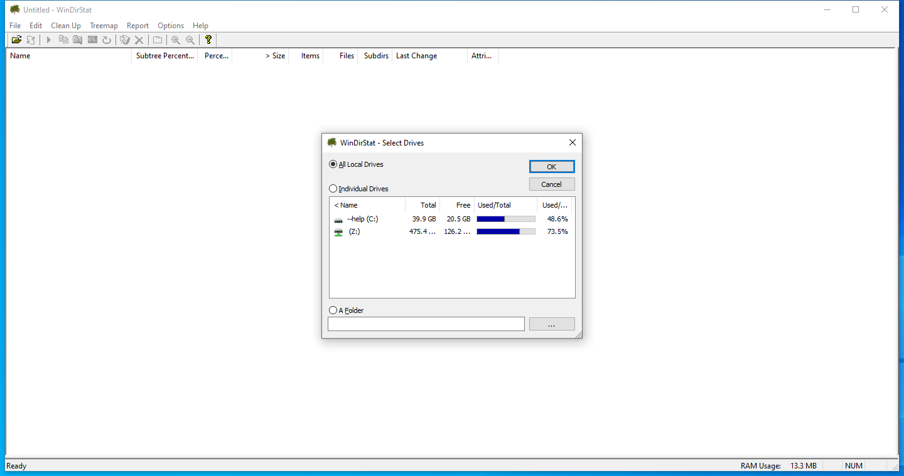
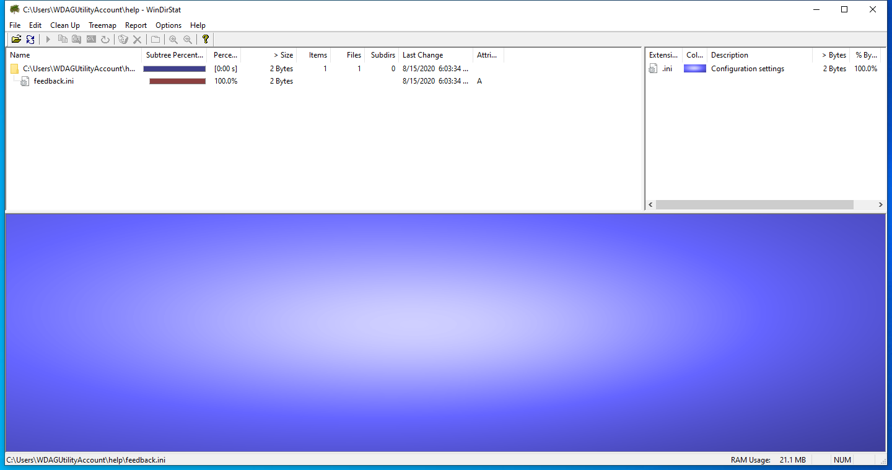

---
title: windirstat.exe | Windows Directory Statistics
excerpt: What is windirstat.exe?
---

# windirstat.exe 

* File Path: `C:\Program Files (x86)\WinDirStat\windirstat.exe`
* Description: Windows Directory Statistics

## Screenshot

## Hashes

Type | Hash
-- | --
MD5 | `24CD9A82FCFC658DD3AE7BA25C958FFB`
SHA1 | `26E14A532E1E050EB20755A0B7A5FEA99DD80588`
SHA256 | `CC3EE246F2710DC9BA9E2A88E3192B88F1DB4CAA2EEFB8641642A33DF04E585C`
SHA384 | `4A242873B1136D4368FEDB4F29B80CEA968BD300737EFF15B5731FEDBC27C8F36B36C004417ED58207C732E8CD6624A4`
SHA512 | `4DE675BE1F7D618D133EF24765A027840473E0C5BC93550D5E5FDBF078EDC74C2241E6E3CD8753517E2954C7F09B9909028DE7B727294D723FB5700658C7979D`
SSDEEP | `12288:o5UnhjOmG0fJO6egoEQFauJsfmhR5ju0phsQkPaUynbiljjQt6pgw/HuADm:qUnxUjJVhRZdpmQkYyjjQtSgK`
IMP | `7C6D8E50D7C0E8326FCE0F8EECB79276`
PESHA1 | `1BCF85C5A012CC66098B7245FA8ADDC4A2DFD1F7`
PE256 | `F75FB5C23B87E9CF1CC770F797A5BFCC6AC89D378CFFC24D8DE30D92E3D1B0F3`

## Runtime Data

### Window Title:
C:\temp\strontic-xcyclopedia\calc.dll - WinDirStat

### Open Handles:

Path | Type
-- | --
(R-D)   C:\Windows\Fonts\StaticCache.dat | File
(R-D)   C:\Windows\System32\en-US\shell32.dll.mui | File
(RW-)   C:\Windows | File
(RW-)   C:\Windows\WinSxS\x86_microsoft.windows.common-controls_6595b64144ccf1df_6.0.19041.488_none_11b1e5df2ffd8627 | File
(RW-)   C:\xCyclopedia | File
(RWD)   C:\Users\user\AppData\Local\Microsoft\Windows\Explorer\iconcache_16.db | File
(RWD)   C:\Users\user\AppData\Local\Microsoft\Windows\Explorer\iconcache_idx.db | File
\BaseNamedObjects\__ComCatalogCache__ | Section
\BaseNamedObjects\C:\*ProgramData\*Microsoft\*Windows\*Caches\*{6AF0698E-D558-4F6E-9B3C-3716689AF493}.2.ver0x0000000000000003.db | Section
\BaseNamedObjects\C:\*ProgramData\*Microsoft\*Windows\*Caches\*{DDF571F2-BE98-426D-8288-1A9A39C3FDA2}.2.ver0x0000000000000002.db | Section
\BaseNamedObjects\C:\*ProgramData\*Microsoft\*Windows\*Caches\*cversions.2 | Section
\BaseNamedObjects\NLS_CodePage_1252_3_2_0_0 | Section
\BaseNamedObjects\NLS_CodePage_437_3_2_0_0 | Section
\BaseNamedObjects\windows_shell_global_counters | Section
\Sessions\1\BaseNamedObjects\windows_shell_global_counters | Section
\Sessions\1\Windows\Theme2547664911 | Section
\Windows\Theme3854699184 | Section

### Loaded Modules:

Path |
-- |
C:\Program Files (x86)\WinDirStat\windirstat.exe |
C:\Windows\SYSTEM32\ntdll.dll |
C:\Windows\System32\wow64.dll |
C:\Windows\System32\wow64cpu.dll |
C:\Windows\System32\wow64win.dll |

## Signature

* Status: The file C:\Program Files (x86)\WinDirStat\windirstat.exe is not digitally signed. You cannot run this script on the current system. For more information about running scripts and setting execution policy, see about_Execution_Policies at https:/go.microsoft.com/fwlink/?LinkID=135170
* Serial: ``
* Thumbprint: ``
* Issuer: 
* Subject: 

## File Metadata

* Original Filename: windirstat.exe
* Product Name: WinDirStat
* Company Name: Seifert
* File Version: 1.1.2.80 (Unicode)
* Product Version: 1.1.2.80 (Unicode)
* Language: English (United States)
* Legal Copyright: Copyright (C) 2003-2005 Bernhard Seifert
* Machine Type: 32-bit

## File Scan

* VirusTotal Detections: 0/67
* VirusTotal Link: https://www.virustotal.com/gui/file/cc3ee246f2710dc9ba9e2a88e3192b88f1db4caa2eefb8641642a33df04e585c/detection/

MIT License. Copyright (c) 2020-2021 Strontic.

