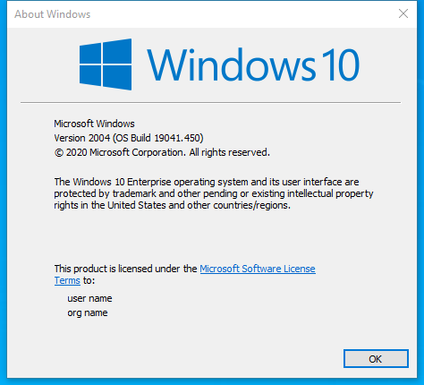

---
title: winver.exe | Version Reporter Applet
excerpt: What is winver.exe?
---

# winver.exe 

* File Path: `C:\Windows\SysWOW64\winver.exe`
* Description: Version Reporter Applet

## Screenshot

## Hashes

Type | Hash
-- | --
MD5 | `B5471B0FB5402FC318C82C994C6BF84D`
SHA1 | `0FCA780392A495E96AA3FF92327A77B049150294`
SHA256 | `E8086C9FA7A33E4E6445DAB05F79EDF8E843945764B21B1024AD2FDB724037DC`
SHA384 | `006D622918DA6AF0D5983069FA342DDBE246A1592D77D9318E6C961FBC0E80E0F34AC73EF655DA4DE0C3335AC1C29EA4`
SHA512 | `DAAA34C689610472F36328ED14F6398BD0C01BE80ACA6F19604F4C076C86A4DB51B94B9C2133D56F5F1879C203D16C7EB214A0A270E8A3E1B7615E972ED2B4F9`
SSDEEP | `768:QAK9l3ya+GSkVhWakkbB5eT905WGnUKxHUe7n8jKBFFptX/7wUXI6s:elya+xakkn6oYY0ewiP8J`
IMP | `6F6011B78CCFE72E1E21C99F70873A70`
PESHA1 | `EDDA6A558E938CE9A688064A9A1DC68D318DFEEF`
PE256 | `9264014DDD52AC6FBA8C74CEEA19B6B598D510310728AFBFAC8BCDE5A3B5F974`

## Runtime Data

### Child Processes:
explorer.exe

### Window Title:
About Windows

### Open Handles:

Path | Type
-- | --
(R-D)   C:\Windows\Fonts\StaticCache.dat | File
(R-D)   C:\Windows\System32\en-US\shell32.dll.mui | File
(R-D)   C:\Windows\SysWOW64\en-US\winver.exe.mui | File
(R-D)   C:\Windows\WinSxS\x86_microsoft.windows.c..-controls.resources_6595b64144ccf1df_6.0.19041.1_en-us_130e63d987a738df\comctl32.dll.mui | File
(RW-)   C:\Users\user\Documents | File
(RW-)   C:\Windows | File
(RW-)   C:\Windows\WinSxS\x86_microsoft.windows.c..-controls.resources_6595b64144ccf1df_6.0.19041.1_en-us_130e63d987a738df | File
(RW-)   C:\Windows\WinSxS\x86_microsoft.windows.common-controls_6595b64144ccf1df_6.0.19041.488_none_11b1e5df2ffd8627 | File
\BaseNamedObjects\NLS_CodePage_1252_3_2_0_0 | Section
\BaseNamedObjects\NLS_CodePage_437_3_2_0_0 | Section
\Sessions\1\Windows\Theme1703657751 | Section
\Windows\Theme1455388728 | Section

### Loaded Modules:

Path |
-- |
C:\Windows\SYSTEM32\ntdll.dll |
C:\Windows\System32\wow64.dll |
C:\Windows\System32\wow64cpu.dll |
C:\Windows\System32\wow64win.dll |
C:\Windows\SysWOW64\winver.exe |

## Signature

* Status: Signature verified.
* Serial: `3300000266BD1580EFA75CD6D3000000000266`
* Thumbprint: `A4341B9FD50FB9964283220A36A1EF6F6FAA7840`
* Issuer: CN=Microsoft Windows Production PCA 2011, O=Microsoft Corporation, L=Redmond, S=Washington, C=US
* Subject: CN=Microsoft Windows, O=Microsoft Corporation, L=Redmond, S=Washington, C=US

## File Metadata

* Original Filename: WINVER.EXE.MUI
* Product Name: Microsoft Windows Operating System
* Company Name: Microsoft Corporation
* File Version: 10.0.19041.1 (WinBuild.160101.0800)
* Product Version: 10.0.19041.1
* Language: English (United States)
* Legal Copyright:  Microsoft Corporation. All rights reserved.
* Machine Type: 32-bit

## File Scan

* VirusTotal Detections: 0/72
* VirusTotal Link: https://www.virustotal.com/gui/file/e8086c9fa7a33e4e6445dab05f79edf8e843945764b21b1024ad2fdb724037dc/detection/

## File Similarity (ssdeep match)

File | Score
-- | --
[C:\Windows\system32\RunLegacyCPLElevated.exe](RunLegacyCPLElevated.exe-087E9B620445BD9C32451060138DEB23.md) | 65
[C:\Windows\system32\RunLegacyCPLElevated.exe](RunLegacyCPLElevated.exe-095CDBFC0D53FC186EE6BA4D82E5B811.md) | 57
[C:\Windows\system32\RunLegacyCPLElevated.exe](RunLegacyCPLElevated.exe-0D0551E591F32BBA1B1701D115883802.md) | 57
[C:\windows\system32\RunLegacyCPLElevated.exe](RunLegacyCPLElevated.exe-517D31BB7C8673F5F3F992656028FD48.md) | 82
[C:\WINDOWS\system32\RunLegacyCPLElevated.exe](RunLegacyCPLElevated.exe-88C2C65B3CAAEA8E424921E4A987E522.md) | 60
[C:\Windows\system32\winver.exe](winver.exe-2FAF36CA1A8C76A14294ABB5E2048CF6.md) | 82
[C:\Windows\system32\winver.exe](winver.exe-3815F11126543C450BDE1AB19559C70A.md) | 82
[C:\Windows\system32\winver.exe](winver.exe-63DC2D604B8A96C9962494D1D957DD77.md) | 83
[C:\WINDOWS\system32\winver.exe](winver.exe-A9E590D2497EDC084324D6A2584B1905.md) | 80
[C:\windows\system32\winver.exe](winver.exe-BD139D1EC36BFD525F62A52B547B3692.md) | 82
[C:\Windows\SysWOW64\RunLegacyCPLElevated.exe](RunLegacyCPLElevated.exe-6C47B937FD6B890B201B451FE7B1FF76.md) | 80
[C:\Windows\SysWOW64\RunLegacyCPLElevated.exe](RunLegacyCPLElevated.exe-848480B7DA5B0428E62938093C183BC0.md) | 68
[C:\windows\SysWOW64\RunLegacyCPLElevated.exe](RunLegacyCPLElevated.exe-9F82D4C1A2CAE60C4D6ECE19B9B1A3FF.md) | 82
[C:\WINDOWS\SysWOW64\RunLegacyCPLElevated.exe](RunLegacyCPLElevated.exe-A16745D0777F337EDADFAA6C3624BAA1.md) | 72
[C:\Windows\SysWOW64\RunLegacyCPLElevated.exe](RunLegacyCPLElevated.exe-E1519821284895922C0DE974BB13DB8B.md) | 75
[C:\windows\SysWOW64\winver.exe](winver.exe-7851B04CB50EE7FEB48D592E1D42B105.md) | 82
[C:\Windows\SysWOW64\winver.exe](winver.exe-D0CD7E799CC087F0F3630AF45F4CAB5A.md) | 85
[C:\WINDOWS\SysWOW64\winver.exe](winver.exe-D828953D9B5DA4E7C73CD10F07741F78.md) | 85
[C:\Windows\SysWOW64\winver.exe](winver.exe-D93830F17D450C7D418534CED70E263B.md) | 82

MIT License. Copyright (c) 2020 Strontic.

