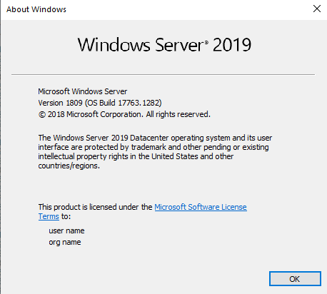

---
title: winver.exe | Version Reporter Applet
---

# winver.exe 

* File Path: `C:\windows\SysWOW64\winver.exe`
* Description: Version Reporter Applet

## Screenshot

## Hashes

Type | Hash
-- | --
MD5 | `D0CD7E799CC087F0F3630AF45F4CAB5A`
SHA1 | `DF90A5AEA9FC189E55C5D9176F648A537CEF79DD`
SHA256 | `97C23B8888FFE8F4A9D9A0DE8EDA27CBE029049CF07E1164C2E79C3623139E42`
SHA384 | `46DE14EAD7FDCD59BE9C68E407C37B99FD4351E1E807BF9CE7A88B8FB636B4159D62623F404CCE7E70CEDA24907E1B06`
SHA512 | `411DCB4E9D7D84CAC5F5145381D016AA04EFB0CDC9BE7A525AA4DED30B47412AB0ADEFBAB8F617CF0BA3024C88DC4166D8CE6BFC7A444C6F64301270E0BFFF15`
SSDEEP | `768:AqVcU4yi+GSkVhWakkbB5eT905WGnUKxHUe7n8jKBFFptX/7wUXj1:AZyi+xakkn6oYY0ewiP82`

## Signature

* Status: Signature verified.
* Serial: `33000001C422B2F79B793DACB20000000001C4`
* Thumbprint: `AE9C1AE54763822EEC42474983D8B635116C8452`
* Issuer: CN=Microsoft Windows Production PCA 2011, O=Microsoft Corporation, L=Redmond, S=Washington, C=US
* Subject: CN=Microsoft Windows, O=Microsoft Corporation, L=Redmond, S=Washington, C=US

## File Metadata

* Original Filename: WINVER.EXE.MUI
* Product Name: Microsoft Windows Operating System
* Company Name: Microsoft Corporation
* File Version: 10.0.17763.1 (WinBuild.160101.0800)
* Product Version: 10.0.17763.1
* Language: English (United States)
* Legal Copyright:  Microsoft Corporation. All rights reserved.

## File Similarity (ssdeep match)

File | Score
-- | --
[C:\Windows\system32\RunLegacyCPLElevated.exe](RunLegacyCPLElevated.exe-087E9B620445BD9C32451060138DEB23.md) | 65
[C:\Windows\system32\RunLegacyCPLElevated.exe](RunLegacyCPLElevated.exe-095CDBFC0D53FC186EE6BA4D82E5B811.md) | 60
[C:\Windows\system32\RunLegacyCPLElevated.exe](RunLegacyCPLElevated.exe-0D0551E591F32BBA1B1701D115883802.md) | 57
[C:\windows\system32\RunLegacyCPLElevated.exe](RunLegacyCPLElevated.exe-517D31BB7C8673F5F3F992656028FD48.md) | 83
[C:\WINDOWS\system32\RunLegacyCPLElevated.exe](RunLegacyCPLElevated.exe-88C2C65B3CAAEA8E424921E4A987E522.md) | 65
[C:\Windows\system32\winver.exe](winver.exe-2FAF36CA1A8C76A14294ABB5E2048CF6.md) | 86
[C:\Windows\system32\winver.exe](winver.exe-3815F11126543C450BDE1AB19559C70A.md) | 82
[C:\Windows\system32\winver.exe](winver.exe-63DC2D604B8A96C9962494D1D957DD77.md) | 82
[C:\WINDOWS\system32\winver.exe](winver.exe-A9E590D2497EDC084324D6A2584B1905.md) | 82
[C:\windows\system32\winver.exe](winver.exe-BD139D1EC36BFD525F62A52B547B3692.md) | 82
[C:\Windows\SysWOW64\RunLegacyCPLElevated.exe](RunLegacyCPLElevated.exe-6C47B937FD6B890B201B451FE7B1FF76.md) | 75
[C:\Windows\SysWOW64\RunLegacyCPLElevated.exe](RunLegacyCPLElevated.exe-848480B7DA5B0428E62938093C183BC0.md) | 72
[C:\windows\SysWOW64\RunLegacyCPLElevated.exe](RunLegacyCPLElevated.exe-9F82D4C1A2CAE60C4D6ECE19B9B1A3FF.md) | 82
[C:\WINDOWS\SysWOW64\RunLegacyCPLElevated.exe](RunLegacyCPLElevated.exe-A16745D0777F337EDADFAA6C3624BAA1.md) | 72
[C:\Windows\SysWOW64\RunLegacyCPLElevated.exe](RunLegacyCPLElevated.exe-E1519821284895922C0DE974BB13DB8B.md) | 77
[C:\windows\SysWOW64\winver.exe](winver.exe-7851B04CB50EE7FEB48D592E1D42B105.md) | 82
[C:\Windows\SysWOW64\winver.exe](winver.exe-B5471B0FB5402FC318C82C994C6BF84D.md) | 85
[C:\WINDOWS\SysWOW64\winver.exe](winver.exe-D828953D9B5DA4E7C73CD10F07741F78.md) | 86
[C:\Windows\SysWOW64\winver.exe](winver.exe-D93830F17D450C7D418534CED70E263B.md) | 85

MIT License. Copyright (c) 2020 Strontic.

