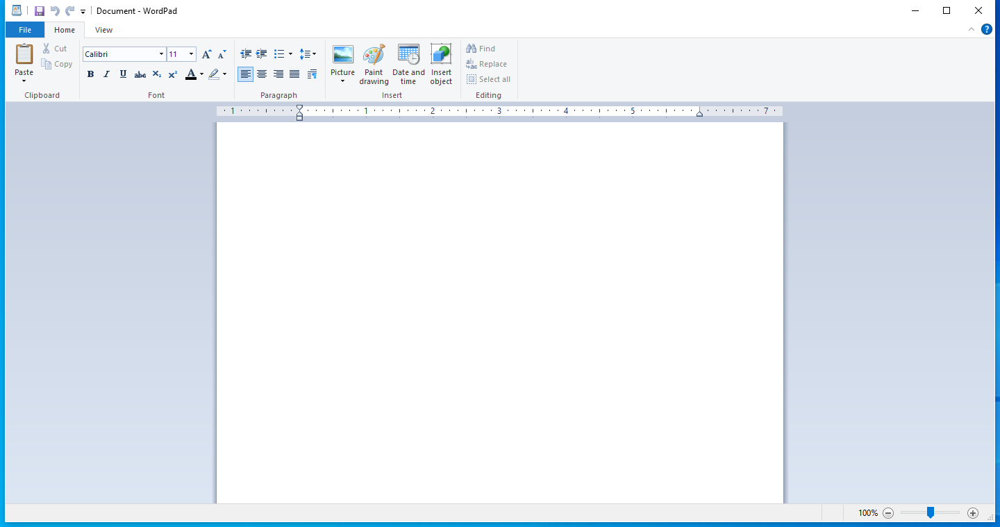
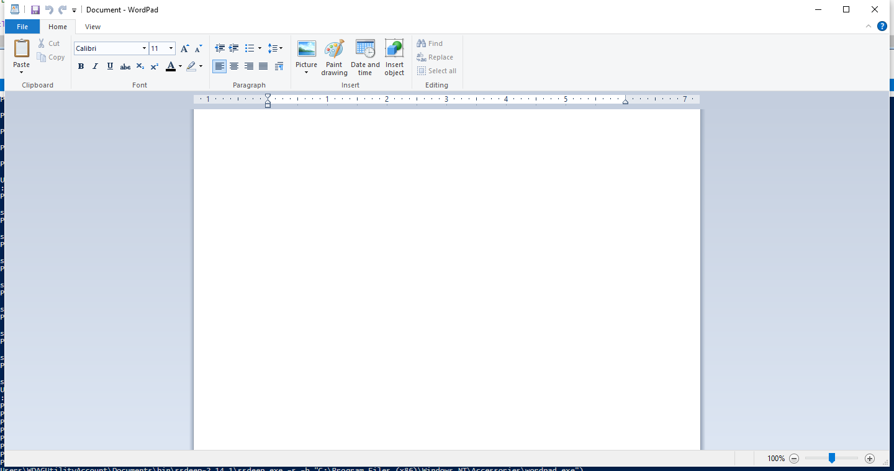
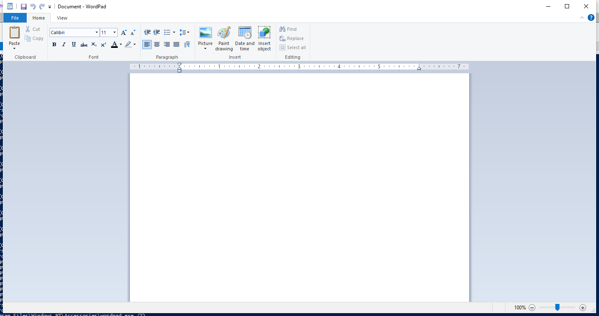

---
title: wordpad.exe | Windows Wordpad Application
excerpt: What is wordpad.exe?
---

# wordpad.exe 

* File Path: `C:\Program Files\windows nt\accessories\wordpad.exe`
* Description: Windows Wordpad Application

## Screenshot

## Hashes

Type | Hash
-- | --
MD5 | `8C90572B1F8F341D72E5417DE7F4418F`
SHA1 | `00CC94610D30D7F022F63BF9E7D823B20AFA5F21`
SHA256 | `657E99BDA5D2487F09F9302F661067B143F096C07C2AB64DD2ED24A2A51C8549`
SHA384 | `7E1107505B276B4822D5A7D00691E98BD6D9FF95ED6600D463B29A194D6B57AEA483B249ABCB2680A8F0029498806988`
SHA512 | `162495A2A40E0DD98F356DEBF276269153F2273611E150A3D05633E674CCD849F933D83B4A9CC0F5D458B1E5A21EEE726567EBF83EF5E1F00FC351BCFC7E72A5`
SSDEEP | `24576:5+CFswwI3HwOCzW295D8a5U6TOqUN2FxvNEtXcPCl9AuDF5zUPGLG5SvAMZAMg9:5+KL3Q8iU6TO2xvW9cPy9AuDzY`
IMP | `59D1F979AE3BD1A315954FF22001C99E`
PESHA1 | `D182FC807EC8EB5BFBE15606D62DE89F8592B5A6`
PE256 | `D756D1FEB256659339897166F4D387643AF81D6506F2D729149FC50BE8D7B0E5`

## Runtime Data

### Window Title:
Document - WordPad

### Open Handles:

Path | Type
-- | --
(R-D)   C:\Program Files\windows nt\accessories\en-US\wordpad.exe.mui | File
(R-D)   C:\Windows\Fonts\StaticCache.dat | File
(R-D)   C:\Windows\System32\en-US\fms.dll.mui | File
(R-D)   C:\Windows\System32\en-US\KernelBase.dll.mui | File
(R-D)   C:\Windows\System32\en-US\MFC42u.dll.mui | File
(R-D)   C:\Windows\System32\en-US\UIRibbon.dll.mui | File
(RW-)   C:\Users\user\Documents | File
(RW-)   C:\Windows\WinSxS\amd64_microsoft.windows.common-controls_6595b64144ccf1df_6.0.17763.1518_none_de6e2bd0534e2567 | File
(RW-)   C:\Windows\WinSxS\amd64_microsoft.windows.gdiplus_6595b64144ccf1df_1.1.17763.1518_none_0f591eb5ade09f35 | File
\BaseNamedObjects\__ComCatalogCache__ | Section
\BaseNamedObjects\C:\*ProgramData\*Microsoft\*Windows\*Caches\*{6AF0698E-D558-4F6E-9B3C-3716689AF493}.2.ver0x0000000000000004.db | Section
\BaseNamedObjects\C:\*ProgramData\*Microsoft\*Windows\*Caches\*{DDF571F2-BE98-426D-8288-1A9A39C3FDA2}.2.ver0x0000000000000004.db | Section
\BaseNamedObjects\C:\*ProgramData\*Microsoft\*Windows\*Caches\*cversions.2.ro | Section
\BaseNamedObjects\NLS_CodePage_1252_3_2_0_0 | Section
\BaseNamedObjects\NLS_CodePage_437_3_2_0_0 | Section
\RPC Control\DSECEB4 | Section
\Sessions\2\BaseNamedObjects\eb4HWNDInterface:80750 | Section
\Sessions\2\BaseNamedObjects\SessionImmersiveColorPreference | Section
\Sessions\2\BaseNamedObjects\windows_shell_global_counters | Section
\Sessions\2\Windows\Theme2131664586 | Section
\Windows\Theme966197582 | Section

### Loaded Modules:

Path |
-- |
C:\Program Files\windows nt\accessories\wordpad.exe |
C:\Windows\SYSTEM32\AcGenral.dll |
C:\Windows\System32\advapi32.dll |
C:\Windows\SYSTEM32\apphelp.dll |
C:\Windows\SYSTEM32\atlthunk.dll |
C:\Windows\System32\Bcp47Langs.dll |
C:\Windows\System32\bcp47mrm.dll |
C:\Windows\System32\bcrypt.dll |
C:\Windows\System32\bcryptPrimitives.dll |
C:\Windows\System32\cfgmgr32.dll |
C:\Windows\System32\clbcatq.dll |
C:\Windows\System32\combase.dll |
C:\Windows\System32\COMDLG32.dll |
C:\Windows\System32\CoreMessaging.dll |
C:\Windows\System32\CoreUIComponents.dll |
C:\Windows\System32\CRYPT32.dll |
C:\Windows\SYSTEM32\CRYPTBASE.DLL |
C:\Windows\System32\cryptsp.dll |
C:\Windows\System32\d2d1.dll |
C:\Windows\system32\d3d11.dll |
C:\Windows\system32\dataexchange.dll |
C:\Windows\system32\dcomp.dll |
C:\Windows\System32\DriverStore\FileRepository\prnms003.inf_amd64_513b04a5b0f1d094\Amd64\PrintConfig.dll |
C:\Windows\system32\dwmapi.dll |
C:\Windows\system32\dxgi.dll |
C:\Windows\SYSTEM32\edputil.dll |
C:\Windows\system32\fms.dll |
C:\Windows\System32\GDI32.dll |
C:\Windows\System32\gdi32full.dll |
C:\Windows\SYSTEM32\globinputhost.dll |
C:\Windows\SYSTEM32\iertutil.dll |
C:\Windows\System32\IMM32.DLL |
C:\Windows\System32\InputHost.dll |
C:\Windows\SYSTEM32\IPHLPAPI.DLL |
C:\Windows\System32\kernel.appcore.dll |
C:\Windows\System32\KERNEL32.DLL |
C:\Windows\System32\KERNELBASE.dll |
C:\Windows\SYSTEM32\MFC42u.dll |
C:\Windows\SYSTEM32\MPR.dll |
C:\Windows\System32\MSASN1.dll |
C:\Windows\System32\MSCTF.dll |
C:\Windows\SYSTEM32\MSFTEDIT.DLL |
C:\Windows\System32\msvcp_win.dll |
C:\Windows\System32\msvcrt.dll |
C:\Windows\System32\msxml3.dll |
C:\Windows\SYSTEM32\ninput.dll |
C:\Windows\SYSTEM32\ntdll.dll |
C:\Windows\SYSTEM32\ntmarta.dll |
C:\Windows\System32\ole32.dll |
C:\Windows\System32\oleacc.dll |
C:\Windows\System32\OLEAUT32.dll |
C:\Windows\System32\powrprof.dll |
C:\Windows\SYSTEM32\prntvpt.dll |
C:\Windows\System32\profapi.dll |
C:\Windows\SYSTEM32\PROPSYS.dll |
C:\Windows\system32\RMCLIENT.dll |
C:\Windows\System32\RPCRT4.dll |
C:\Windows\System32\sechost.dll |
C:\Windows\System32\shcore.dll |
C:\Windows\System32\SHELL32.dll |
C:\Windows\System32\SHLWAPI.dll |
C:\Windows\SYSTEM32\SspiCli.dll |
C:\Windows\System32\TextInputFramework.dll |
C:\Windows\system32\twinapi.appcore.dll |
C:\Windows\System32\ucrtbase.dll |
C:\Windows\system32\UIRibbon.dll |
C:\Windows\SYSTEM32\urlmon.dll |
C:\Windows\System32\USER32.dll |
C:\Windows\SYSTEM32\USERENV.dll |
C:\Windows\system32\uxtheme.dll |
C:\Windows\SYSTEM32\VERSION.dll |
C:\Windows\System32\win32u.dll |
C:\Windows\System32\Windows.Globalization.dll |
C:\Windows\System32\windows.storage.dll |
C:\Windows\System32\Windows.UI.dll |
C:\Windows\system32\windowscodecs.dll |
C:\Windows\SYSTEM32\WINMM.dll |
C:\Windows\SYSTEM32\WINMMBASE.dll |
C:\Windows\SYSTEM32\WINSPOOL.DRV |
C:\Windows\SYSTEM32\wintypes.dll |
C:\Windows\SYSTEM32\XmlLite.dll |
C:\Windows\WinSxS\amd64_microsoft.windows.common-controls_6595b64144ccf1df_6.0.17763.1518_none_de6e2bd0534e2567\COMCTL32.dll |
C:\Windows\WinSxS\amd64_microsoft.windows.gdiplus_6595b64144ccf1df_1.1.17763.1518_none_0f591eb5ade09f35\gdiplus.dll |

## Signature

* Status: Signature verified.
* Serial: `3300000266BD1580EFA75CD6D3000000000266`
* Thumbprint: `A4341B9FD50FB9964283220A36A1EF6F6FAA7840`
* Issuer: CN=Microsoft Windows Production PCA 2011, O=Microsoft Corporation, L=Redmond, S=Washington, C=US
* Subject: CN=Microsoft Windows, O=Microsoft Corporation, L=Redmond, S=Washington, C=US

## File Metadata

* Original Filename: WORDPAD.EXE.MUI
* Product Name: Microsoft Windows Operating System
* Company Name: Microsoft Corporation
* File Version: 10.0.17763.1075 (WinBuild.160101.0800)
* Product Version: 10.0.17763.1075
* Language: English (United States)
* Legal Copyright:  Microsoft Corporation. All rights reserved.
* Machine Type: 64-bit

## File Scan

* VirusTotal Detections: 0/70
* VirusTotal Link: https://www.virustotal.com/gui/file/657e99bda5d2487f09f9302f661067b143f096c07c2ab64dd2ed24a2a51c8549/detection/

## File Similarity (ssdeep match)

File | Score
-- | --
[C:\Program Files (x86)\windows nt\accessories\wordpad.exe](wordpad.exe-AD2FB3DA4D8AA9D8764E92E46CF2518D.md) | 63

## Possible Misuse

*The following table contains possible examples of `wordpad.exe` being misused. While `wordpad.exe` is **not** inherently malicious, its legitimate functionality can be abused for malicious purposes.*

Source | Source File | Example | License
-- | -- | -- | --
[signature-base](https://github.com/Neo23x0/signature-base) | [apt_winnti_burning_umbrella.yar](https://github.com/Neo23x0/signature-base/blob/master/yara/apt_winnti_burning_umbrella.yar) | $s1 = "Wordpad.Document.1\\shell\\open\\command\\" fullword wide | [CC BY-NC 4.0](https://github.com/Neo23x0/signature-base/blob/master/LICENSE)
[signature-base](https://github.com/Neo23x0/signature-base) | [thor-hacktools.yar](https://github.com/Neo23x0/signature-base/blob/master/yara/thor-hacktools.yar) | $s3 = "Accessories\\wordpad.exe" fullword ascii | [CC BY-NC 4.0](https://github.com/Neo23x0/signature-base/blob/master/LICENSE)

MIT License. Copyright (c) 2020 Strontic.

