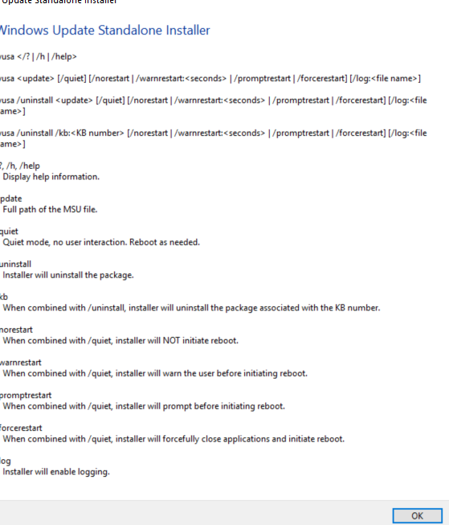

---
title: wusa.exe | Windows Update Standalone Installer
excerpt: What is wusa.exe?
---

# wusa.exe 

* File Path: `C:\Windows\system32\wusa.exe`
* Description: Windows Update Standalone Installer

## Screenshot

## Hashes

Type | Hash
-- | --
MD5 | `E7A1BF42A43A9031533768B393D5673A`
SHA1 | `9AB7C88456C62ED88D0000E4B6F218A379DD0090`
SHA256 | `5AA6B0E7D1839A1E430DB80F180A09D7C07657DDC35C3396756D5CBEF72B75C8`
SHA384 | `CC38BB577AB7C5DDD2DDBE20864C4CBCCCF11D6D91CA1353DFB7C4665B349992E1EECD39897D88DD0A757009E457FEDA`
SHA512 | `5D0B26DA97215FF2FA6C2B06D61935AB08874A6FF6EF9EFD036BA9FD0624B8D226802EDA5D939183BBD4DECE9C81AA4BB5550D416CBC55CA75B1F4329A3E6005`
SSDEEP | `6144:vUpf+bIZfL49UoCczcuMHxM4w+LpxyN90vE:vUpGb+qURGMHxMSby90`

## Signature

* Status: Signature verified.
* Serial: `3300000266BD1580EFA75CD6D3000000000266`
* Thumbprint: `A4341B9FD50FB9964283220A36A1EF6F6FAA7840`
* Issuer: CN=Microsoft Windows Production PCA 2011, O=Microsoft Corporation, L=Redmond, S=Washington, C=US
* Subject: CN=Microsoft Windows, O=Microsoft Corporation, L=Redmond, S=Washington, C=US

## File Metadata

* Original Filename: wusa.exe.mui
* Product Name: Microsoft Windows Operating System
* Company Name: Microsoft Corporation
* File Version: 10.0.14393.0 (rs1_release.160715-1616)
* Product Version: 10.0.14393.0
* Language: English (United States)
* Legal Copyright:  Microsoft Corporation. All rights reserved.

## File Similarity (ssdeep match)

File | Score
-- | --
[C:\Windows\system32\wusa.exe](wusa.exe-59701FE9C8BA85BCEB73A9B1B3E8E1C4.md) | 47
[C:\WINDOWS\system32\wusa.exe](wusa.exe-7E8AE39BE13B6F0A7CAD480B7148123F.md) | 41
[C:\windows\system32\wusa.exe](wusa.exe-8930570F7F76840334962EFC6C173438.md) | 43
[C:\Windows\system32\wusa.exe](wusa.exe-8A0B789F779802881EEAC4F99532A35C.md) | 44
[C:\Windows\system32\wusa.exe](wusa.exe-E43499EE2B4CF328A81BACE9B1644C5D.md) | 40
[C:\Windows\SysWOW64\wusa.exe](wusa.exe-18DE1F2C1BC5B1AFE3A66DD973C69411.md) | 41
[C:\Windows\SysWOW64\wusa.exe](wusa.exe-6B5F21E4B1FA9B4BF6AD402A9EA52887.md) | 35
[C:\Windows\SysWOW64\wusa.exe](wusa.exe-6C81724C47077509C4CC874E34008FC3.md) | 40
[C:\Windows\SysWOW64\wusa.exe](wusa.exe-A60D32269A6A6E7BFDC50E22A70B8F54.md) | 36
[C:\WINDOWS\SysWOW64\wusa.exe](wusa.exe-C46BE74BD433DD95952142967E3F1F9A.md) | 33
[C:\windows\SysWOW64\wusa.exe](wusa.exe-F3EF56F76D69361022B47EF1E6201644.md) | 36

## Possible Misuse

*The following table contains possible examples of `wusa.exe` being misused. While `wusa.exe` is **not** inherently malicious, its legitimate functionality can be abused for malicious purposes.*

Source | Source File | Example | License
-- | -- | -- | --
[sigma](https://github.com/Neo23x0/sigma) | [sysmon_uac_bypass_ntfs_reparse_point.yml](https://github.com/Neo23x0/sigma/blob/master/rules/windows/file_event/sysmon_uac_bypass_ntfs_reparse_point.yml) | `description: Detects the pattern of UAC Bypass using NTFS reparse point and wusa.exe DLL hijacking (UACMe 36)`{:.highlight .language-yaml} | [DRL 1.0](https://github.com/Neo23x0/sigma/blob/master/LICENSE.Detection.Rules.md)
[sigma](https://github.com/Neo23x0/sigma) | [win_uac_bypass_ntfs_reparse_point.yml](https://github.com/Neo23x0/sigma/blob/master/rules/windows/process_creation/win_uac_bypass_ntfs_reparse_point.yml) | `description: Detects the pattern of UAC Bypass using NTFS reparse point and wusa.exe DLL hijacking (UACMe 36)`{:.highlight .language-yaml} | [DRL 1.0](https://github.com/Neo23x0/sigma/blob/master/LICENSE.Detection.Rules.md)
[sigma](https://github.com/Neo23x0/sigma) | [win_uac_bypass_ntfs_reparse_point.yml](https://github.com/Neo23x0/sigma/blob/master/rules/windows/process_creation/win_uac_bypass_ntfs_reparse_point.yml) | `CommandLine\|startswith: '"C:\Windows\system32\wusa.exe"  /quiet C:\Users\'`{:.highlight .language-yaml} | [DRL 1.0](https://github.com/Neo23x0/sigma/blob/master/LICENSE.Detection.Rules.md)
[signature-base](https://github.com/Neo23x0/signature-base) | [apt_thrip.yar](https://github.com/Neo23x0/signature-base/blob/master/yara/apt_thrip.yar) | $s5 = "wusa.exe" fullword ascii | [CC BY-NC 4.0](https://github.com/Neo23x0/signature-base/blob/master/LICENSE)
[signature-base](https://github.com/Neo23x0/signature-base) | [apt_thrip.yar](https://github.com/Neo23x0/signature-base/blob/master/yara/apt_thrip.yar) | $s4 = "wusa.exe" fullword ascii | [CC BY-NC 4.0](https://github.com/Neo23x0/signature-base/blob/master/LICENSE)

MIT License. Copyright (c) 2020-2021 Strontic.

