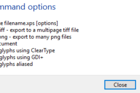
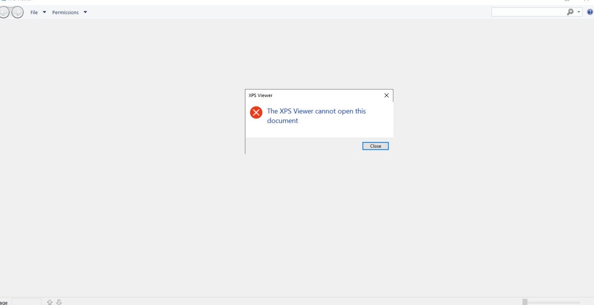

---
title: xpsrchvw.exe | XPS Viewer
---

# xpsrchvw.exe 

* File Path: `C:\windows\SysWOW64\xpsrchvw.exe`
* Description: XPS Viewer

## Screenshot

## Hashes

Type | Hash
-- | --
MD5 | `1B0235FBA270018B86EA326AD7944CB0`
SHA1 | `B591D65769C410611C4DA43ACB7F4B11D47393E0`
SHA256 | `43AA9E85009DC934EDA66A109A9A6881FB8A0E12AC3C1C68706C7996AB399F98`
SHA384 | `80B28723DA2A43C98453BE6D8E2674D7C08EB59B1F8C58D0427E190F4D30658C880CB5FA07AC21056FCAF2EE7DC2A5C5`
SHA512 | `0CE72301D700168A444FDC3163DD03D015DE88C51F26AF6BF755D4B81982B6F6B0670FC147E63E86396331DF06317D1856E9648B495FD0BFDD993EB0EBEF15E1`
SSDEEP | `98304:XTf1DfaFze6UBnDWLKZ644efwf+fsUMBYtaQMw5:Ddade6UBb644efwf+fsUMnw`

## Signature

* Status: Signature verified.
* Serial: `3300000266BD1580EFA75CD6D3000000000266`
* Thumbprint: `A4341B9FD50FB9964283220A36A1EF6F6FAA7840`
* Issuer: CN=Microsoft Windows Production PCA 2011, O=Microsoft Corporation, L=Redmond, S=Washington, C=US
* Subject: CN=Microsoft Windows, O=Microsoft Corporation, L=Redmond, S=Washington, C=US

## File Metadata

* Original Filename: xpsrchvw.exe.mui
* Product Name: Microsoft Windows Operating System
* Company Name: Microsoft Corporation
* File Version: 10.0.17763.1 (WinBuild.160101.0800)
* Product Version: 10.0.17763.1
* Language: English (United States)
* Legal Copyright:  Microsoft Corporation. All rights reserved.

MIT License. Copyright (c) 2020 Strontic.

