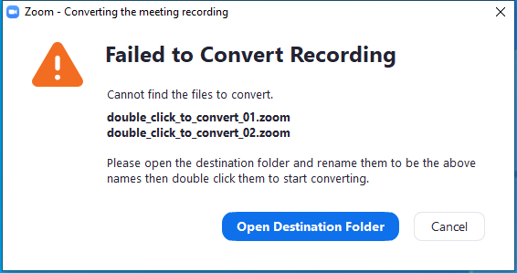

---
title: zTscoder.exe | Zoom
---

# zTscoder.exe 

* File Path: `C:\program files (x86)\Zoom\bin\zTscoder.exe`
* Description: Zoom
* Comments: Zoom

## Screenshot

## Hashes

Type | Hash
-- | --
MD5 | `DEAB73614D4D7C0807C5391FED75035A`
SHA1 | `23C4F75A2A2364796D54F2659F601916A121920C`
SHA256 | `048563BAA3A9E22250D1802673B116A28BB283EB5FEF64178943830575B4808A`
SHA384 | `DD15B5A71401737256D05DBA1B96E150417F12DAC2C765234286C47F81541B2D809813C1A5DFA308FC6C34E368DB2A22`
SHA512 | `5C53295C57562EB60ECE52ACE1CC819D416AF7560C08BFB56AA6E5749D63369C854FA1609A71766E68EF7328BA79E574C5F43A568441B23789C19884B9CA185D`
SSDEEP | `3072:QqPnswJKqfdtWqg09j45NCY7smlp3vKpRBvK2Acx:QoKqfdtWqWNCY7vCpRBCQ`

## Runtime Data

### Window Title:
Zoom - Converting the meeting recording

### Open Handles:

Path | Type
-- | --
(R-D)   C:\Windows\Fonts\StaticCache.dat | File
(R-D)   C:\Windows\System32\en-US\crypt32.dll.mui | File
(RW-)   C:\Users\user\AppData\Roaming\Zoom\appsafecheck.txt | File
(RW-)   C:\Users\user\Documents | File
(RW-)   C:\Windows | File
(RW-)   C:\Windows\WinSxS\x86_microsoft.windows.common-controls_6595b64144ccf1df_6.0.19041.1_none_fd031af45b0106f2 | File
(RW-)   C:\Windows\WinSxS\x86_microsoft.windows.gdiplus_6595b64144ccf1df_1.1.19041.450_none_4294d6e08a97344a | File
\BaseNamedObjects\__ComCatalogCache__ | Section
\BaseNamedObjects\NLS_CodePage_1252_3_2_0_0 | Section
\BaseNamedObjects\NLS_CodePage_437_3_2_0_0 | Section
\Sessions\1\BaseNamedObjects\34600a18-94c2-4d03-99d5-17e42110d4b1 | Section
\Sessions\1\BaseNamedObjects\windows_shell_global_counters | Section
\Sessions\1\Windows\Theme4048709601 | Section
\Windows\Theme603176458 | Section

### Loaded Modules:

Path |
-- |
C:\program files (x86)\Zoom\bin\zTscoder.exe |
C:\Windows\SYSTEM32\ntdll.dll |
C:\Windows\System32\wow64.dll |
C:\Windows\System32\wow64cpu.dll |
C:\Windows\System32\wow64win.dll |

## Signature

* Status: Signature verified.
* Serial: `0510C6B2FF7AB71C786EF572239B1243`
* Thumbprint: `0F9ADA46756C17EFFFD467D10654E2A766566CB3`
* Issuer: CN=DigiCert EV Code Signing CA (SHA2), OU=www.digicert.com, O=DigiCert Inc, C=US
* Subject: CN="Zoom Video Communications, Inc.", O="Zoom Video Communications, Inc.", L=San Jose, S=California, C=US, SERIALNUMBER=4969967, OID.2.5.4.15=Private Organization, OID.1.3.6.1.4.1.311.60.2.1.2=Delaware, OID.1.3.6.1.4.1.311.60.2.1.3=US

## File Metadata

* Original Filename: Zoom
* Product Name: Zoom
* Company Name: Zoom Video Communications, Inc.
* File Version: 5,2,44052,0816
* Product Version: 5,2,44052,0816
* Language: English (United States)
* Legal Copyright:  Zoom Video Communications, Inc. All rights reserved.

## File Similarity (ssdeep match)

File | Score
-- | --
[C:\program files (x86)\Zoom\bin\Zoom.exe](Zoom.exe-65CA9E0DF3C8B0D76BB0126B0C593A3C.md) | 33
[C:\Program Files (x86)\Zoom\bin\Zoom.exe](Zoom.exe-EF568D198B3DEDB38FCC19FA94950B06.md) | 35
[C:\program files (x86)\Zoom\bin\ZoomDocConverter.exe](ZoomDocConverter.exe-99C31B5AA52C51669444A916B3C02BB7.md) | 38
[C:\Program Files (x86)\Zoom\bin\ZoomDocConverter.exe](ZoomDocConverter.exe-F5575E3999B99035CFAC687907102B12.md) | 36
[C:\Program Files (x86)\Zoom\bin\zTscoder.exe](zTscoder.exe-F95816E6ED240884AA0AA47BCE0229B4.md) | 41

MIT License. Copyright (c) 2020 Strontic.

